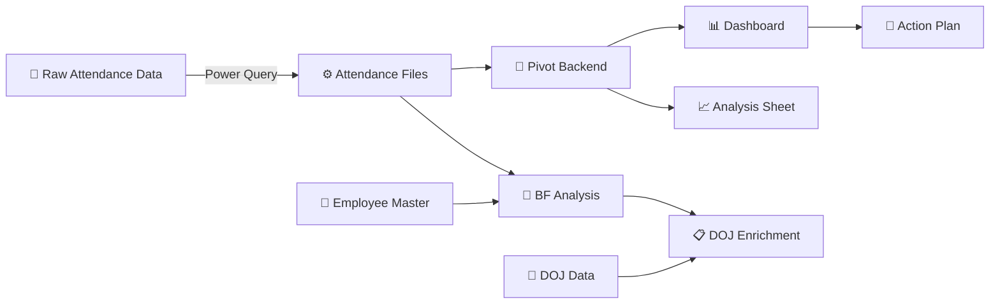

# 📊 Workforce Absenteeism Analytics Dashboard

### Turning Raw Attendance Data into Actionable Workforce Intelligence

---

*A comprehensive, interactive Excel dashboard that automates attendance tracking, calculates Bradford Factor risk scores, identifies absenteeism trends, and provides actionable intervention strategies — built entirely with Advanced Excel, Power Query, and no code.*

---

## 📌 The Story

My manager handed me raw attendance data and asked for analysis — just findings and insights.

Instead of a one-time report, I built **a fully automated, interactive dashboard** that:
- Ingests raw attendance data automatically via Power Query
- Calculates UPA (Unplanned Absence) percentages per employee per month
- Computes Bradford Factor scores to identify absenteeism risk patterns
- Visualizes trends across time, teams, and individuals
- Generates automated risk categorization and recommended actions
- Includes a 3-phase strategic action plan to reduce absenteeism

**What started as a simple data request became an official project** — adopted by the team for ongoing workforce analytics and absenteeism reduction.

---

## 🧠 The Problem

Workforce absenteeism was being tracked manually with no systematic analysis:

| Challenge | Impact |
|:----------|:-------|
| No visibility into absenteeism patterns | Trends went undetected until they became critical |
| No risk scoring mechanism | Couldn't distinguish between occasional and chronic absenteeism |
| Manual data compilation | Time-consuming and error-prone monthly reporting |
| No team-level comparison | Couldn't identify which teams needed intervention |
| Reactive approach | Issues addressed only after significant impact on operations |
| No actionable framework | Data existed but didn't translate into decisions |

---

## ✅ The Solution

A **9-sheet, multi-layer Excel dashboard** with automated data pipeline, analytics engine, and interactive visualization:

---

## 🏗️ Dashboard Architecture

The solution consists of **9 interconnected sheets** across **4 functional layers**:

### Layer 1: Data Input
| Sheet | Purpose | Key Features |
|:------|:--------|:-------------|
| **Attendance Files** | Raw data ingestion point | 13 fields: Name, Team Leader, Month, Year, EL, Half EL, UPA Days, Working Days, UPA%, Actual Working Days, Absence Days, Absence Spells, Bradford Factor Score |

### Layer 2: Master Data
| Sheet | Purpose | Key Features |
|:------|:--------|:-------------|
| **Employee Master** | Employee-to-Team Leader mapping | Complete roster with team assignments |
| **DOJ Data** | Date of Joining + Tenurity | Employees with auto-calculated tenurity bands (0–6 months, 6–12 months, 1–2 years, 2+ tenured) |

### Layer 3: Analytics Engine
| Sheet | Purpose | Key Features |
|:------|:--------|:-------------|
| **Pivot Backend** | Core calculation engine | 4 pivot data areas: Monthly Trend, BF Scores, TL Performance, Top Employees |
| **BF Analysis** | Bradford Factor scoring | Auto-categorized risk levels with recommended actions |
| **DOJ** | Enriched risk view | BF scores cross-referenced with tenure data |
| **Analysis** | UPA Days breakdown | Filterable pivot with Year/Month/Team Leader slicers |

### Layer 4: Presentation & Action
| Sheet | Purpose | Key Features |
|:------|:--------|:-------------|
| **Dashboard** | Interactive visual interface | 4 charts, KPI cards, slicers for dynamic filtering |
| **Action Plan** | Strategic recommendations | 12 actions across 3 phases (Short/Medium/Long-term) |

---

## 📊 Dashboard Components

### KPI Summary Cards
| Metric | Description |
|:-------|:------------|
| **Average UPA%** | Organization-wide unplanned absence percentage |
| **Highest UPA%** | Maximum individual UPA% for flagging |
| **Lowest UPA%** | Benchmark for best attendance performance |

### Interactive Charts
| Chart | Type | Purpose |
|:------|:-----|:--------|
| **UPA% Trend Over Time** | Line Chart | Track monthly absenteeism patterns across years |
| **Average UPA% by Team Leader** | Bar Chart | Compare team-level performance |
| **Top 5 Employees by UPA%** | Bar Chart | Identify highest absenteeism individuals |
| **Top 20 Employee Analysis** | Bar Chart | Broader workforce view for pattern detection |

### Dynamic Filters (Slicers)
| Filter | Capability |
|:-------|:-----------|
| **Year** | Filter all views by specific year |
| **Month** | Drill into specific months |
| **Team Leader** | Isolate team-specific data |

---

## 🧮 Bradford Factor Scoring

The dashboard implements the **Bradford Factor** — an industry-standard formula used in HR analytics to identify problematic absence patterns:

**Formula: `BF = S² × D`**

| Variable | Meaning |
|:---------|:--------|
| **S** | Number of absence spells (separate instances) |
| **D** | Total number of absence days |

### Why Bradford Factor?
The formula **penalizes frequent short absences more heavily** than fewer long absences — because multiple short, unplanned absences are more operationally disruptive.

**Example:**
| Scenario | Spells (S) | Days (D) | BF Score |
|:---------|:-----------|:---------|:---------|
| 1 absence of 10 days | 1 | 10 | 1² × 10 = **10** |
| 10 absences of 1 day each | 10 | 10 | 10² × 10 = **1,000** |

Same total days, but the frequent short absences score **100x higher** — reflecting their greater operational disruption.

### Automated Risk Categorization

| BF Score | Risk Level | Dashboard Action |
|:---------|:-----------|:----------------|
| **0–50** | 🟢 Low Risk | Standard attendance — no action needed |
| **51–100** | 🟡 Monitor Closely | Watch for developing patterns |
| **101–200** | 🟠 Potential Trend | Informal chat or wellness check recommended |
| **201+** | 🔴 High Risk | Formal review / disciplinary consideration |

---

## ⚙️ Power Query Pipeline

The dashboard uses **Power Query** for automated data ingestion:

| Stage | What Happens |
|:------|:-------------|
| **Connect** | Links to raw attendance data source |
| **Transform** | Cleans, formats, and standardizes the data |
| **Calculate** | Computes UPA%, Absence Days, Absence Spells |
| **Load** | Pushes processed data into the Attendance Files sheet |
| **Refresh** | One-click refresh updates all downstream calculations, pivots, and charts |

### Why Power Query?
| Benefit | Impact |
|:--------|:-------|
| **Automation** | Eliminates manual data entry and copy-paste errors |
| **Consistency** | Same transformations applied every refresh cycle |
| **Scalability** | Can handle growing datasets without restructuring |
| **Auditability** | Every transformation step is documented and visible |
| **Speed** | Monthly updates take seconds instead of hours |

---

## 📋 3-Phase Action Plan

The dashboard doesn't just show data — it includes a **strategic action framework**:

### Phase 1: Short-Term (0–30 Days)
| Action | Owner | Expected Outcome |
|:-------|:------|:----------------|
| 1:1 discussions with high-frequency absentees | TL/Manager | Understand root causes |
| Daily attendance monitoring dashboard | Ops/HR | Early detection of patterns |
| Contingency plan for sudden absenteeism | TL | Ensure SLA stability |
| Pre-reporting of possible leave | Employees | Reduce same-day absences |

### Phase 2: Medium-Term (30–90 Days)
| Action | Owner | Expected Outcome |
|:-------|:------|:----------------|
| Cross-training program | L&D/TL | Balance workload |
| Wellness programs | HR | Reduce health-related absenteeism |
| Shift flexibility | Ops | Improve work-life balance |
| Attendance recognition & rewards | HR/TL | Improve engagement |

### Phase 3: Long-Term (90+ Days)
| Action | Owner | Expected Outcome |
|:-------|:------|:----------------|
| Quarterly workload assessment | Ops | Reduce burnout |
| Predictive absenteeism analytics | MI/Analytics | Forecast staffing gaps |
| Employee support systems | HR | Sustainability |
| Policy refresh | HR | Better compliance |

---

## 🛠️ Technical Skills Demonstrated

| Category | Skills |
|:---------|:-------|
| **Data Engineering** | Power Query (ETL pipeline, automated ingestion, data transformation) |
| **Data Modeling** | Multi-sheet relational architecture, master data management, pivot backends |
| **Analytics** | Bradford Factor implementation, trend analysis, risk scoring, comparative analysis |
| **Visualization** | Interactive dashboard with charts, KPI cards, slicers, conditional formatting |
| **Business Intelligence** | Translating raw data into actionable workforce insights |
| **Strategic Thinking** | 3-phase action plan with owners, timelines, and expected outcomes |
| **Automation** | One-click data refresh, auto-calculated scores, automated risk categorization |
| **Problem Solving** | Transformed a simple data request into a comprehensive analytics platform |

---

## 📖 Documentation

### Design & Methodology
| Document | Description |
|:---------|:------------|
| [Solution Design](docs/solution-design.md) | Complete architecture and design overview |
| [Methodology](docs/methodology.md) | Analytical approach and framework |
| [Bradford Factor Explained](docs/bradford-factor-explained.md) | Deep dive into the scoring system |
| [Power Query Pipeline](docs/power-query-pipeline.md) | Data ingestion and transformation details |
| [Business Case](docs/business-case.md) | Business impact and value delivered |
| [Lessons Learned](docs/lessons-learned.md) | Key takeaways and reflections |

### Architecture
| Document | Description |
|:---------|:------------|
| [Dashboard Architecture](architecture/dashboard-architecture.md) | 9-sheet architecture and layer design |
| [Data Model](architecture/data-model.md) | Data relationships and flow |
| [Design Decisions](architecture/design-decisions.md) | Key choices and trade-offs |

### Resources
| Document | Description |
|:---------|:------------|
| [Presentation Summary](resources/presentation-summary.md) | One-page project overview |
| [FAQ](resources/faq.md) | Common questions answered |

---

## 📂 Repository Structure

workforce-absenteeism-dashboard/ ├── README.md ├── CONTRIBUTING.md ├── CHANGELOG.md ├── LICENSE ├── docs/ │ ├── solution-design.md │ ├── methodology.md │ ├── bradford-factor-explained.md │ ├── power-query-pipeline.md │ ├── business-case.md │ └── lessons-learned.md ├── architecture/ │ ├── dashboard-architecture.md │ ├── data-model.md │ └── design-decisions.md └── resources/ ├── presentation-summary.md └── faq.md

---

## 🎯 What Makes This Project Unique

- 📊 **Born from a real business need** — not a tutorial or demo project
- 📈 **Adopted as an official project** — the team took it over for ongoing use
- 🧮 **Bradford Factor implementation** — industry-standard HR analytics methodology
- ⚙️ **Fully automated pipeline** — Power Query eliminates manual data handling
- 🎯 **Data → Decisions** — includes strategic action plan, not just visualizations
- 🏗️ **Enterprise-grade architecture** — 9 interconnected sheets with clean separation of concerns
- 🚫 **Zero code** — built entirely with Advanced Excel and Power Query
- 🔄 **One-click refresh** — entire dashboard updates with a single click
- 🙋 **Self-initiated scope expansion** — manager asked for analysis, I delivered a platform

---

## 🔒 Compliance Note

> This repository is a **portfolio case study** documenting the methodology, architecture, and analytical approach. All data shown is **anonymized sample data**. No company names, employee identities, proprietary processes, or confidential information is included.

---

## 📄 License

This project is licensed under the [MIT License](LICENSE).

---

**Built with 📊 Advanced Excel, ⚙️ Power Query, and 🧠 Analytical Thinking**

*A portfolio case study demonstrating data engineering, analytics, and business intelligence capabilities.*

⭐ Star this repo if you find it useful!

