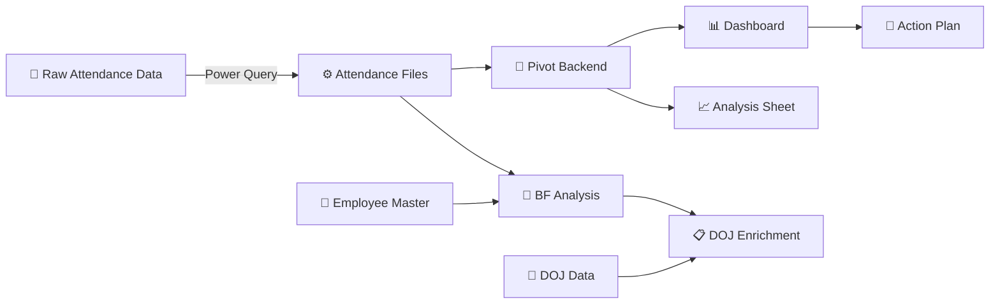
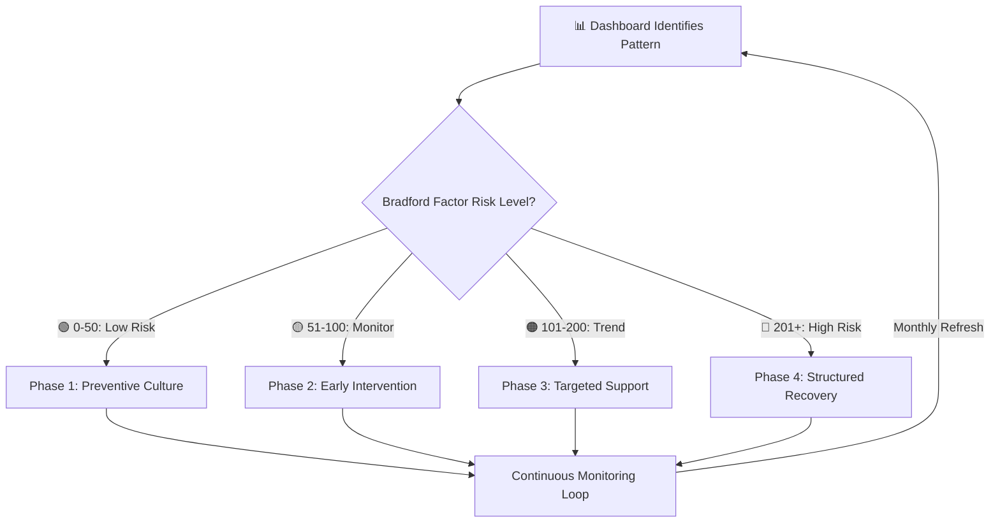

<div align="center">

# 📊 Workforce Absenteeism Analytics Dashboard

### Turning Raw Attendance Data into Actionable Workforce Intelligence

[](https://www.microsoft.com/excel)
[](https://learn.microsoft.com/en-us/power-query/)
[](https://en.wikipedia.org/wiki/Bradford_Factor)
[](https://support.microsoft.com/en-us/office/create-a-pivottable)
[](https://en.wikipedia.org/wiki/No-code_development_platform)

---

*A comprehensive, interactive Excel dashboard that automates attendance tracking, calculates Bradford Factor risk scores, identifies absenteeism trends, and provides actionable intervention strategies — built entirely with Advanced Excel, Power Query, and no code.*

</div>

---

## 📌 The Story

My manager handed me raw attendance data and asked for analysis — just findings and insights.

Instead of a one-time report, I built **a fully automated, interactive dashboard** that:
- Ingests raw attendance data automatically via Power Query
- Calculates UPA (Unplanned Absence) percentages per employee per month
- Computes Bradford Factor scores to identify absenteeism risk patterns
- Visualizes trends across time, teams, and individuals
- Generates automated risk categorization and recommended actions
- Includes a strategic intervention framework to reduce absenteeism

**What started as a simple data request became an official project** — adopted by the team for ongoing workforce analytics and absenteeism reduction.

---

## 🧠 The Problem

Workforce absenteeism was being tracked manually with no systematic analysis:

| Challenge | Impact |
|:----------|:-------|
| No visibility into absenteeism patterns | Trends went undetected until they became critical |
| No risk scoring mechanism | Couldn't distinguish between occasional and chronic absenteeism |
| Manual data compilation | Time-consuming and error-prone monthly reporting |
| No team-level comparison | Couldn't identify which teams needed intervention |
| Reactive approach | Issues addressed only after significant impact on operations |
| No actionable framework | Data existed but didn't translate into decisions |

---

## ✅ The Solution

A **9-sheet, multi-layer Excel dashboard** with automated data pipeline, analytics engine, and interactive visualization:



---

## 🏗️ Dashboard Architecture

The solution consists of **9 interconnected sheets** across **4 functional layers**:

### Layer 1: Data Input
| Sheet | Purpose | Key Features |
|:------|:--------|:-------------|
| **Attendance Files** | Raw data ingestion point | 13 fields: Name, Team Leader, Month, Year, EL, Half EL, UPA Days, Working Days, UPA%, Actual Working Days, Absence Days, Absence Spells, Bradford Factor Score |

### Layer 2: Master Data
| Sheet | Purpose | Key Features |
|:------|:--------|:-------------|
| **Employee Master** | Employee-to-Team Leader mapping | Complete roster with team assignments |
| **DOJ Data** | Date of Joining + Tenurity | Employees with auto-calculated tenurity bands (0–6 months, 6–12 months, 1–2 years, 2+ tenured) |

### Layer 3: Analytics Engine
| Sheet | Purpose | Key Features |
|:------|:--------|:-------------|
| **Pivot Backend** | Core calculation engine | 4 pivot data areas: Monthly Trend, BF Scores, TL Performance, Top Employees |
| **BF Analysis** | Bradford Factor scoring | Auto-categorized risk levels with recommended actions |
| **DOJ** | Enriched risk view | BF scores cross-referenced with tenure data |
| **Analysis** | UPA Days breakdown | Filterable pivot with Year/Month/Team Leader slicers |

### Layer 4: Presentation & Action
| Sheet | Purpose | Key Features |
|:------|:--------|:-------------|
| **Dashboard** | Interactive visual interface | 4 charts, KPI cards, slicers for dynamic filtering |
| **Action Plan** | Strategic recommendations | Data-driven intervention framework across multiple phases |

---

## 📊 Dashboard Components

### KPI Summary Cards
| Metric | Description |
|:-------|:------------|
| **Average UPA%** | Organization-wide unplanned absence percentage |
| **Highest UPA%** | Maximum individual UPA% for flagging |
| **Lowest UPA%** | Benchmark for best attendance performance |

### Interactive Charts
| Chart | Type | Purpose |
|:------|:-----|:--------|
| **UPA% Trend Over Time** | Line Chart | Track monthly absenteeism patterns across years |
| **Average UPA% by Team Leader** | Bar Chart | Compare team-level performance |
| **Top 5 Employees by UPA%** | Bar Chart | Identify highest absenteeism individuals |
| **Top 20 Employee Analysis** | Bar Chart | Broader workforce view for pattern detection |

### Dynamic Filters (Slicers)
| Filter | Capability |
|:-------|:-----------|
| **Year** | Filter all views by specific year |
| **Month** | Drill into specific months |
| **Team Leader** | Isolate team-specific data |

---

## 🧮 Bradford Factor Scoring

The dashboard implements the **Bradford Factor** — an industry-standard formula used in HR analytics to identify problematic absence patterns:

**Formula: `BF = S² × D`**

| Variable | Meaning |
|:---------|:--------|
| **S** | Number of absence spells (separate instances) |
| **D** | Total number of absence days |

### Why Bradford Factor?
The formula **penalizes frequent short absences more heavily** than fewer long absences — because multiple short, unplanned absences are more operationally disruptive.

**Example:**
| Scenario | Spells (S) | Days (D) | BF Score |
|:---------|:-----------|:---------|:---------|
| 1 absence of 10 days | 1 | 10 | 1² × 10 = **10** |
| 10 absences of 1 day each | 10 | 10 | 10² × 10 = **1,000** |

Same total days, but the frequent short absences score **100x higher** — reflecting their greater operational disruption.

### Automated Risk Categorization

| BF Score | Risk Level | Dashboard Action |
|:---------|:-----------|:----------------|
| **0–50** | 🟢 Low Risk | Standard attendance — no action needed |
| **51–100** | 🟡 Monitor Closely | Watch for developing patterns |
| **101–200** | 🟠 Potential Trend | Informal chat or wellness check recommended |
| **201+** | 🔴 High Risk | Formal review / disciplinary consideration |

---

## ⚙️ Power Query Pipeline

The dashboard uses **Power Query** for automated data ingestion:

| Stage | What Happens |
|:------|:-------------|
| **Connect** | Links to raw attendance data source |
| **Transform** | Cleans, formats, and standardizes the data |
| **Calculate** | Computes UPA%, Absence Days, Absence Spells |
| **Load** | Pushes processed data into the Attendance Files sheet |
| **Refresh** | One-click refresh updates all downstream calculations, pivots, and charts |

### Why Power Query?
| Benefit | Impact |
|:--------|:-------|
| **Automation** | Eliminates manual data entry and copy-paste errors |
| **Consistency** | Same transformations applied every refresh cycle |
| **Scalability** | Can handle growing datasets without restructuring |
| **Auditability** | Every transformation step is documented and visible |
| **Speed** | Monthly updates take seconds instead of hours |

---

## 📋 Data-Driven Intervention Framework

The dashboard doesn't just surface data — it includes a **strategic, multi-phase intervention framework** designed using insights derived from the analytics. This framework is **universally applicable** to any organization managing workforce absenteeism.

### The Intervention Logic



### Phase 1: Preventive Culture (BF Score 0–50 — Low Risk)
*Goal: Maintain healthy attendance patterns and prevent escalation*

| Strategy | Approach | Expected Outcome | Success Metric |
|:---------|:---------|:-----------------|:---------------|
| **Attendance Recognition Program** | Publicly recognize and reward consistent attendance monthly/quarterly | Reinforces positive behavior, builds cultural norm | Recognition rate ≥ 80% of eligible employees |
| **Transparent Team Dashboards** | Share anonymized team-level UPA% trends with all teams | Creates healthy peer accountability and awareness | Team-level UPA% awareness score ≥ 90% |
| **Proactive Leave Planning** | Encourage advance leave scheduling through team calendars and planning tools | Converts unplanned absences into planned leave | Planned-to-unplanned leave ratio improves by 20% |
| **Team Leader Coaching** | Equip team leaders with data literacy to read and act on dashboard insights | Builds frontline management capability | 100% TL dashboard adoption |

### Phase 2: Early Intervention (BF Score 51–100 — Monitor Closely)
*Goal: Identify emerging patterns before they become chronic*

| Strategy | Approach | Expected Outcome | Success Metric |
|:---------|:---------|:-----------------|:---------------|
| **Pattern Detection Alerts** | Dashboard flags employees crossing BF threshold of 51 automatically | Shifts from reactive to proactive management | Time-to-detect reduced from months to days |
| **Supportive 1:1 Check-ins** | Manager conducts non-punitive wellness conversation within 5 business days of alert | Identifies root causes early (health, workload, personal) | 100% check-in completion within SLA |
| **Workload & Burnout Assessment** | Review task distribution and overtime patterns for flagged employees | Addresses systemic causes, not just symptoms | Workload balance score improves by 15% |
| **Flexible Work Arrangements** | Offer temporary schedule adjustments based on individual needs | Reduces absence triggers while maintaining productivity | 30% reduction in repeat absence spells |

### Phase 3: Targeted Support (BF Score 101–200 — Potential Trend)
*Goal: Provide structured support to reverse developing absence patterns*

| Strategy | Approach | Expected Outcome | Success Metric |
|:---------|:---------|:-----------------|:---------------|
| **Individualized Attendance Improvement Plan** | Collaboratively create a 30/60/90-day plan with clear milestones | Gives employee ownership and structure for improvement | 70% of employees show BF score reduction within 90 days |
| **Root Cause Analysis** | Deep-dive into absence patterns: timing, frequency, correlation with workload cycles | Uncovers hidden systemic factors driving absenteeism | Documented root causes for 100% of Phase 3 employees |
| **Wellness & EAP Referral** | Proactively connect employee with Employee Assistance Programs and wellness resources | Addresses health, mental health, and personal challenges | EAP utilization rate increases by 25% |
| **Cross-Training & Backup Coverage** | Train team members to cover key functions, reducing return-to-work anxiety | Reduces operational impact AND employee pressure | Zero SLA breaches due to individual absence |
| **Tenure-Adjusted Approach** | Cross-reference BF scores with DOJ data to tailor support (new joiners vs. tenured) | New joiners may need onboarding support; tenured may need re-engagement | Retention rate for flagged employees ≥ 85% |

### Phase 4: Structured Recovery (BF Score 201+ — High Risk)
*Goal: Formal, documented process that balances support with accountability*

| Strategy | Approach | Expected Outcome | Success Metric |
|:---------|:---------|:-----------------|:---------------|
| **Formal Review Meeting** | Documented meeting with HR, manager, and employee reviewing BF data and patterns | Creates transparency and formal record | 100% formal documentation compliance |
| **Structured Improvement Agreement** | Written agreement with specific attendance targets, support provided, and review dates | Clear expectations for both employee and organization | Signed agreement within 10 business days |
| **Weekly Progress Monitoring** | Dashboard tracks week-over-week attendance with automated alerts to manager and HR | Ensures sustained improvement, not just short-term compliance | Weekly compliance reporting accuracy ≥ 95% |
| **Re-integration Support** | Phased return plan for employees with extended absence history | Prevents relapse by gradually rebuilding attendance habits | Re-integration completion rate ≥ 80% |
| **Policy Escalation Pathway** | If no improvement after 90 days, escalate per organizational attendance policy | Maintains fairness while protecting operational integrity | Escalation only after all support phases exhausted |

### Continuous Improvement Loop

| Activity | Frequency | Owner | Purpose |
|:---------|:----------|:------|:--------|
| **Dashboard Refresh & Review** | Monthly | Analytics Lead | Update data, refresh pivots, recalculate BF scores |
| **Team Leader Briefing** | Monthly | Operations Manager | Share team-level insights, celebrate improvements |
| **Trend Analysis Report** | Quarterly | HR/Analytics | Identify seasonal patterns, year-over-year comparison |
| **Framework Effectiveness Review** | Quarterly | HR + Operations | Assess which interventions are working, adjust strategies |
| **Predictive Pattern Analysis** | Semi-Annual | Analytics Lead | Use historical data to forecast high-risk periods |
| **Policy & Framework Update** | Annual | HR + Leadership | Incorporate learnings, update thresholds if needed |

---

## 🛠️ Technical Skills Demonstrated

| Category | Skills |
|:---------|:-------|
| **Data Engineering** | Power Query (ETL pipeline, automated ingestion, data transformation) |
| **Data Modeling** | Multi-sheet relational architecture, master data management, pivot backends |
| **Analytics** | Bradford Factor implementation, trend analysis, risk scoring, comparative analysis |
| **Visualization** | Interactive dashboard with charts, KPI cards, slicers, conditional formatting |
| **Business Intelligence** | Translating raw data into actionable workforce insights |
| **Strategic Thinking** | Multi-phase intervention framework with success metrics and continuous improvement |
| **Automation** | One-click data refresh, auto-calculated scores, automated risk categorization |
| **Problem Solving** | Transformed a simple data request into a comprehensive analytics platform |

---

## 📖 Documentation

### Design & Methodology
| Document | Description |
|:---------|:------------|
| [Solution Design](docs/solution-design.md) | Complete architecture and design overview |
| [Methodology](docs/methodology.md) | Analytical approach and framework |
| [Bradford Factor Explained](docs/bradford-factor-explained.md) | Deep dive into the scoring system |
| [Power Query Pipeline](docs/power-query-pipeline.md) | Data ingestion and transformation details |
| [Business Case](docs/business-case.md) | Business impact and value delivered |
| [Lessons Learned](docs/lessons-learned.md) | Key takeaways and reflections |

### Architecture
| Document | Description |
|:---------|:------------|
| [Dashboard Architecture](architecture/dashboard-architecture.md) | 9-sheet architecture and layer design |
| [Data Model](architecture/data-model.md) | Data relationships and flow |
| [Design Decisions](architecture/design-decisions.md) | Key choices and trade-offs |

### Resources
| Document | Description |
|:---------|:------------|
| [Presentation Summary](resources/presentation-summary.md) | One-page project overview |
| [FAQ](resources/faq.md) | Common questions answered |

---

## 📂 Repository Structure

```
workforce-absenteeism-dashboard/
├── README.md
├── CONTRIBUTING.md
├── CHANGELOG.md
├── LICENSE
├── docs/
│   ├── solution-design.md
│   ├── methodology.md
│   ├── bradford-factor-explained.md
│   ├── power-query-pipeline.md
│   ├── business-case.md
│   └── lessons-learned.md
├── architecture/
│   ├── dashboard-architecture.md
│   ├── data-model.md
│   └── design-decisions.md
└── resources/
    ├── presentation-summary.md
    └── faq.md
```

---

## 🎯 What Makes This Project Unique

- 📊 **Born from a real business need** — not a tutorial or demo project
- 📈 **Adopted as an official project** — the team took it over for ongoing use
- 🧮 **Bradford Factor implementation** — industry-standard HR analytics methodology
- ⚙️ **Fully automated pipeline** — Power Query eliminates manual data handling
- 🎯 **Data → Decisions** — includes strategic intervention framework, not just visualizations
- 🏗️ **Enterprise-grade architecture** — 9 interconnected sheets with clean separation of concerns
- 🚫 **Zero code** — built entirely with Advanced Excel and Power Query
- 🔄 **One-click refresh** — entire dashboard updates with a single click
- 🙋 **Self-initiated scope expansion** — manager asked for analysis, I delivered a platform

---

## 🔒 Compliance Note

> This repository is a **portfolio case study** documenting the methodology, architecture, and analytical approach. All data shown is **anonymized sample data**. No company names, employee identities, proprietary processes, or confidential information is included.

---

## 📄 License

This project is licensed under the [MIT License](LICENSE).

---

<div align="center">

**Built with 📊 Advanced Excel, ⚙️ Power Query, and 🧠 Analytical Thinking**

*A portfolio case study demonstrating data engineering, analytics, and business intelligence capabilities.*

⭐ Star this repo if you find it useful!

</div>
