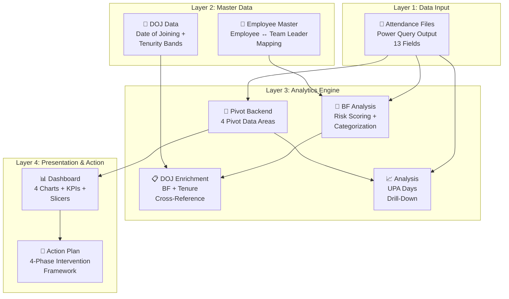
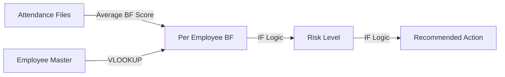
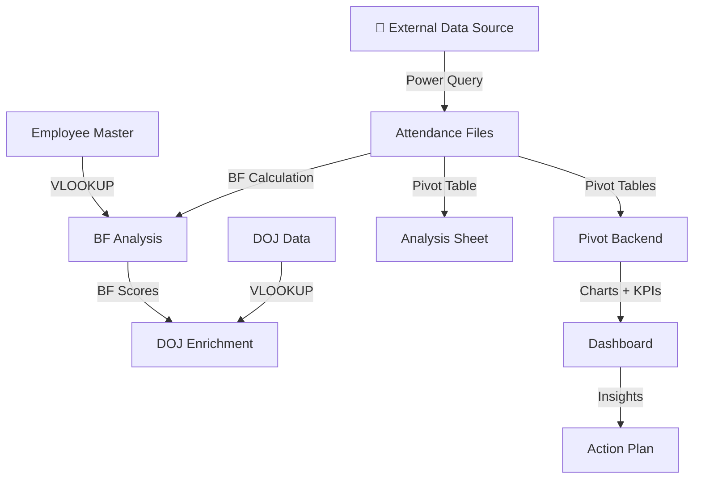

# 🏗️ Dashboard Architecture

## Overview

This document provides a comprehensive breakdown of the 9-sheet, 4-layer architecture that powers the Workforce Absenteeism Analytics Dashboard. The architecture was designed with separation of concerns, scalability, and maintainability as core principles — and evolved iteratively across three phases.

---

## 🎯 Architecture Principles

| Principle | Application |
|:----------|:-----------|
| **Separation of Concerns** | Each sheet has exactly one responsibility — no sheet does double duty |
| **Single Source of Truth** | All data enters through one point (Attendance Files via Power Query); everything downstream derives from it |
| **Layered Design** | 4 distinct layers: Input → Master Data → Analytics → Presentation |
| **Automation First** | Power Query handles ingestion; formulas handle categorization; pivots handle aggregation |
| **Read-Only Presentation** | The Dashboard sheet only displays — it never calculates or stores raw data |
| **Extensibility** | New analysis dimensions (like DOJ) can be added as new sheets without modifying existing ones |

---

## 📐 4-Layer Architecture

---

## 📋 Complete Sheet Map

| # | Sheet Name | Layer | Added In | Primary Role | Reads From | Feeds Into |
|:--|:-----------|:------|:---------|:-------------|:-----------|:-----------|
| 1 | Attendance Files | Layer 1: Input | Phase 1 | Raw data landing zone (Power Query output) | External data source | Pivot Backend, BF Analysis, Analysis |
| 2 | Employee Master | Layer 2: Master | Phase 2 | Employee-to-Team Leader mapping | Manual/HR input | BF Analysis |
| 3 | DOJ Data | Layer 2: Master | Phase 3 | Date of Joining + tenurity classification | Manual/HR input | DOJ Enrichment |
| 4 | Pivot Backend | Layer 3: Analytics | Phase 1 | Core calculation engine — 4 pivot data areas | Attendance Files | Dashboard, Analysis |
| 5 | BF Analysis | Layer 3: Analytics | Phase 2 | Bradford Factor scoring + risk categorization | Attendance Files, Employee Master | DOJ Enrichment |
| 6 | DOJ | Layer 3: Analytics | Phase 3 | Enriched view: BF scores + tenure context | BF Analysis, DOJ Data | Standalone analysis |
| 7 | Analysis | Layer 3: Analytics | Phase 1 | UPA Days breakdown with interactive slicers | Attendance Files, Pivot Backend | Standalone drill-down |
| 8 | Dashboard | Layer 4: Presentation | Phase 1 | Interactive visual interface for stakeholders | Pivot Backend | Action Plan |
| 9 | Action Plan | Layer 4: Presentation | Phase 1 | Strategic intervention framework | Dashboard insights | Decision-making |

---

## 🔍 Layer-by-Layer Deep Dive

### Layer 1: Data Input

#### Attendance Files

| Attribute | Detail |
|:----------|:-------|
| **Role** | The single entry point for all attendance data |
| **Populated by** | Power Query (fully automated) |
| **Format** | Excel Table (enables auto-expanding pivot table ranges) |
| **Refresh** | One-click Power Query refresh |
| **Added in** | Phase 1 |

**Schema (13 Fields):**

| # | Field | Type | Source | Purpose |
|:--|:------|:-----|:-------|:--------|
| 1 | Name | Text | Raw data | Employee identifier (anonymized) |
| 2 | Team Leader | Text | Raw data | Team assignment |
| 3 | Month | Text | Raw data | Reporting month |
| 4 | Year | Number | Raw data | Reporting year |
| 5 | EL | Number | Raw data | Earned Leave days taken (unplanned) |
| 6 | H EL | Number | Raw data | Half Earned Leave days taken |
| 7 | UPA Days | Number | Calculated | Total unplanned absence days |
| 8 | Total Working Days | Number | Raw data | Business days in the month |
| 9 | UPA% | Percentage | Calculated | Unplanned absence rate |
| 10 | Actual Working Days | Number | Calculated | Days actually worked |
| 11 | Absence Days (D) | Number | Calculated | Bradford Factor input — total days |
| 12 | Absence Spells (S) | Number | Calculated | Bradford Factor input — separate instances |
| 13 | Bradford Factor Score | Number | Calculated | S² × D risk score |

**Design Decision:** All 13 fields are loaded in a single flat table — this makes it pivot-friendly and eliminates the need for complex joins at the analytics layer.

---

### Layer 2: Master Data

#### Employee Master

| Attribute | Detail |
|:----------|:-------|
| **Role** | Maps every employee to their Team Leader |
| **Populated by** | Manual input or HR data export |
| **Added in** | Phase 2 (when BF Analysis needed team-level context) |
| **Records** | ~67 active employees |

**Why a Separate Sheet?**
- Team structures change — having a separate master means updates happen in one place
- Lookup formulas (VLOOKUP/INDEX-MATCH) pull Team Leader data into the BF Analysis sheet
- Avoids embedding team mapping logic in the raw data pipeline

#### DOJ Data

| Attribute | Detail |
|:----------|:-------|
| **Role** | Stores Date of Joining and auto-calculates tenurity |
| **Populated by** | Manual input or HR data export |
| **Added in** | Phase 3 |
| **Records** | ~120 employees (includes historical records) |

**Tenurity Bands (Auto-Calculated):**

| Band | Calculation Logic | Interpretation |
|:-----|:-----------------|:---------------|
| 0–6 Months | Current Date - DOJ ≤ 180 days | New joiner — still adjusting |
| 6–12 Months | Current Date - DOJ ≤ 365 days | Settling in — should be stabilizing |
| 1–2 Years | Current Date - DOJ ≤ 730 days | Established — patterns reflect true behavior |
| 2+ Years | Current Date - DOJ > 730 days | Tenured — high BF may signal disengagement |

---

### Layer 3: Analytics Engine

#### Pivot Backend

| Attribute | Detail |
|:----------|:-------|
| **Role** | Core calculation engine powering the dashboard |
| **Contains** | 4 separate pivot data areas |
| **Added in** | Phase 1 |

**4 Pivot Data Areas:**

| # | Pivot Area | What It Calculates | Feeds |
|:--|:-----------|:-------------------|:------|
| 1 | **Monthly Trend** | Average UPA% by Month and Year | Line Chart (UPA% Trend Over Time) |
| 2 | **BF Scores** | Selected employee Bradford Factor scores | Top Employee charts |
| 3 | **TL Performance** | Average UPA% by Team Leader | Bar Chart (TL Comparison) |
| 4 | **Top 20 Employees** | Highest 20 employees by UPA% | Bar Chart (Top 20 Analysis) |

**Design Decision:** All pivots live in one backend sheet rather than scattered across multiple sheets. This keeps the Dashboard sheet clean and makes it easy to manage all pivot configurations in one place.

#### BF Analysis

| Attribute | Detail |
|:----------|:-------|
| **Role** | Bradford Factor scoring and automated risk categorization |
| **Added in** | Phase 2 |
| **Logic Flow** | Calculate average BF per employee → Categorize risk → Generate recommended action |

**Processing Pipeline:**

#### DOJ (Enrichment)

| Attribute | Detail |
|:----------|:-------|
| **Role** | Combines BF scores with tenure data |
| **Added in** | Phase 3 |
| **Combined View** | Employee + BF Score + Risk Level + DOJ + Tenurity Band + Team Leader |

**Why a Separate Enrichment Sheet?**
- Keeps the core BF Analysis sheet untouched (Phase 2 integrity preserved)
- Adds tenure context as an overlay, not a modification
- Enables tenure-specific filtering and analysis

#### Analysis

| Attribute | Detail |
|:----------|:-------|
| **Role** | UPA Days breakdown with interactive filtering |
| **Contains** | Pivot table with Year/Month/Team Leader slicers |
| **Added in** | Phase 1 |
| **Purpose** | Provides drill-down capability beyond the summary dashboard |

---

### Layer 4: Presentation & Action

#### Dashboard

| Attribute | Detail |
|:----------|:-------|
| **Role** | Interactive visual interface for stakeholders |
| **Added in** | Phase 1 (enhanced in Phase 2 and 3) |
| **Design Rule** | Display only — no calculations, no raw data, no formulas |

**Components:**

| Component | Type | Count | Data Source |
|:----------|:-----|:------|:-----------|
| **Charts** | Line + Bar | 4 | Pivot Backend |
| **KPI Cards** | Merged cells with formulas | 3 | Attendance Files (aggregated) |
| **Slicers** | Interactive filters | 3 | Connected to Pivot Tables |

**KPI Card Details:**

| KPI | Formula Approach | Purpose |
|:----|:----------------|:--------|
| Average UPA% | AVERAGE of UPA% across all records | Organizational baseline |
| Highest UPA% | MAX of UPA% | Flags worst case for attention |
| Lowest UPA% | MIN of UPA% (Team Leader level) | Benchmark for best performance |

#### Action Plan

| Attribute | Detail |
|:----------|:-------|
| **Role** | Translates dashboard insights into strategic actions |
| **Added in** | Phase 1 (enhanced across phases) |
| **Framework** | 4-phase intervention model linked to Bradford Factor risk tiers |

**Phases:**

| Phase | BF Score Trigger | Focus |
|:------|:----------------|:------|
| Phase 1: Preventive Culture | 0–50 | Maintain healthy patterns |
| Phase 2: Early Intervention | 51–100 | Catch emerging patterns early |
| Phase 3: Targeted Support | 101–200 | Structured support for developing trends |
| Phase 4: Structured Recovery | 201+ | Formal process balancing support and accountability |

---

## 🔄 Data Flow Summary

---

## 📊 Evolution Across Phases

| Component | Phase 1 | Phase 2 | Phase 3 |
|:----------|:--------|:--------|:--------|
| **Attendance Files** | ✅ Created | Unchanged | Unchanged |
| **Employee Master** | — | ✅ Created | Unchanged |
| **DOJ Data** | — | — | ✅ Created |
| **Pivot Backend** | ✅ Created | Enhanced | Unchanged |
| **BF Analysis** | — | ✅ Created | Unchanged |
| **DOJ Enrichment** | — | — | ✅ Created |
| **Analysis** | ✅ Created | Unchanged | Unchanged |
| **Dashboard** | ✅ Created | Enhanced (BF visuals) | Unchanged |
| **Action Plan** | ✅ Created | Enhanced (BF-linked actions) | Enhanced (tenure-adjusted) |

**Key Observation:** Phase 1 sheets were never modified in later phases — new capabilities were added as new sheets. This validates the separation of concerns architecture.

---

## 🎯 Architecture Strengths

| Strength | Evidence |
|:---------|:---------|
| **Extensible** | Added 4 new sheets across Phase 2 and 3 without modifying any Phase 1 sheets |
| **Maintainable** | Any sheet can be debugged independently by following the data flow |
| **Scalable** | Table-based data + pivot tables handle growing datasets automatically |
| **User-Friendly** | Stakeholders interact only with Layer 4 — complexity is hidden |
| **Auditable** | Every data transformation and calculation is traceable through the layers |
| **Resilient** | If one analysis sheet has an issue, other sheets continue working |

---

## 📚 Related Documents

- [Data Model](data-model.md) — Field definitions and data relationships
- [Design Decisions](design-decisions.md) — Key architectural choices and trade-offs
- [Solution Design](../docs/solution-design.md) — Overall solution overview
- [Power Query Pipeline](../docs/power-query-pipeline.md) — Layer 1 data ingestion details
- [Bradford Factor Explained](../docs/bradford-factor-explained.md) — Layer 3 BF Analysis details
