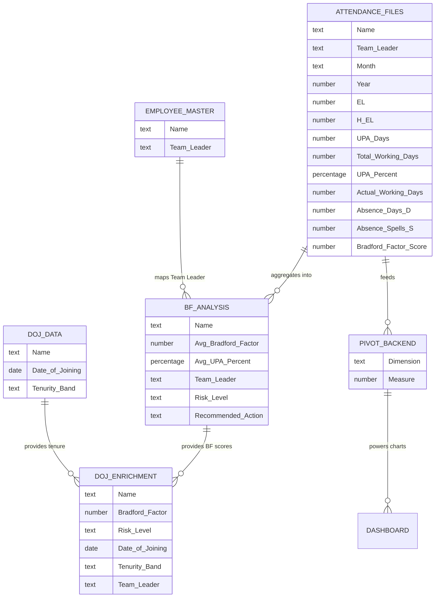

# 📊 Data Model

## Overview

This document defines the complete data model of the Workforce Absenteeism Analytics Dashboard — including all fields, data types, relationships between sheets, and how data flows from raw input to final presentation. Understanding this model is essential for anyone looking to extend, replicate, or learn from the dashboard architecture.

---

## 🎯 Data Model Principles

| Principle | Application |
|:----------|:-----------|
| **Flat table at the core** | Attendance Files uses a flat (denormalized) table — optimized for pivot tables and simplicity |
| **Lookup-based relationships** | Master data sheets connect to analytics sheets via VLOOKUP/INDEX-MATCH, not complex joins |
| **Calculated fields in pipeline** | Key metrics are calculated in Power Query during load — not as Excel formulas on the sheet |
| **Additive layers** | Each phase added new data entities without modifying existing ones |
| **Anonymized identifiers** | All employee and team leader data uses generic identifiers (Employee 1, Team Leader 1) |

---

## 📐 Entity Relationship Diagram



---

## 📋 Complete Field Dictionary

### Attendance Files (Layer 1 — Data Input)

| # | Field Name | Data Type | Source | Calculation | Description |
|:--|:-----------|:----------|:-------|:-----------|:------------|
| 1 | **Name** | Text | Raw data | — | Anonymized employee identifier (e.g., "Employee 1") |
| 2 | **Team Leader** | Text | Raw data | — | Anonymized team leader identifier (e.g., "Team Leader 1") |
| 3 | **Month** | Text | Raw data | — | Reporting month (Jan, Feb, etc.) |
| 4 | **Year** | Number | Raw data | — | Reporting year (e.g., 2025, 2026) |
| 5 | **EL** | Number | Raw data | — | Earned Leave days taken (unplanned) |
| 6 | **H EL** | Number | Raw data | — | Half Earned Leave days taken |
| 7 | **UPA Days** | Number | Calculated | EL + (H EL × 0.5) | Total unplanned absence days |
| 8 | **Total Working Days** | Number | Raw data | — | Business days in the reporting month |
| 9 | **UPA%** | Percentage | Calculated | UPA Days ÷ Total Working Days | Unplanned absence rate |
| 10 | **Actual Working Days** | Number | Calculated | Total Working Days − UPA Days | Days the employee actually worked |
| 11 | **Absence Days (D)** | Number | Calculated | Total days absent across all spells | Bradford Factor input — duration component |
| 12 | **Absence Spells (S)** | Number | Calculated | Count of separate absence instances | Bradford Factor input — frequency component |
| 13 | **Bradford Factor Score** | Number | Calculated | S² × D | Risk score indicating absence pattern severity |

---

### Employee Master (Layer 2 — Master Data)

| # | Field Name | Data Type | Source | Description |
|:--|:-----------|:----------|:-------|:------------|
| 1 | **Name** | Text | HR input | Employee identifier — matches Attendance Files Name field |
| 2 | **Team Leader** | Text | HR input | Team Leader assigned to this employee |

**Relationship:** One-to-one mapping. Each employee has exactly one Team Leader. Used by BF Analysis via VLOOKUP to pull Team Leader context.

**Records:** ~67 active employees

---

### DOJ Data (Layer 2 — Master Data)

| # | Field Name | Data Type | Source | Calculation | Description |
|:--|:-----------|:----------|:-------|:-----------|:------------|
| 1 | **Name** | Text | HR input | — | Employee identifier — matches Attendance Files Name field |
| 2 | **Date of Joining** | Date | HR input | — | The date the employee joined the organization |
| 3 | **Tenurity Band** | Text | Calculated | Based on (Current Date − DOJ) | Auto-classified: 0–6 Months, 6–12 Months, 1–2 Years, 2+ Tenured |

**Tenurity Band Logic:**

| Condition | Band Assigned |
|:----------|:-------------|
| Current Date − DOJ ≤ 180 days | 0 to 6 Months |
| Current Date − DOJ ≤ 365 days | 6 to 12 Months |
| Current Date − DOJ ≤ 730 days | 1 to 2 Years |
| Current Date − DOJ > 730 days | 2+ Tenured |

**Records:** ~120 employees (includes historical)

---

### BF Analysis (Layer 3 — Analytics)

| # | Field Name | Data Type | Source | Calculation | Description |
|:--|:-----------|:----------|:-------|:-----------|:------------|
| 1 | **Name** | Text | Attendance Files | Grouped | Employee identifier |
| 2 | **Avg Bradford Factor** | Number | Attendance Files | AVERAGE of BF scores across all months | Rolling average risk score |
| 3 | **Avg UPA%** | Percentage | Attendance Files | AVERAGE of UPA% across all months | Rolling average absence rate |
| 4 | **Team Leader** | Text | Employee Master | VLOOKUP | Pulled from master data for context |
| 5 | **Risk Level** | Text | Calculated | IF-based on Avg BF | 4-tier categorization (Low/Monitor/Trend/High) |
| 6 | **Recommended Action** | Text | Calculated | IF-based on Risk Level | Specific action to take |

**Risk Level Logic:**

| Avg BF Score | Risk Level Assigned | Recommended Action |
|:-------------|:-------------------|:-------------------|
| > 200 | High Risk | Formal Review |
| > 100 | Potential Trend | Informal Chat / Wellness Check |
| > 50 | Monitor Closely | Watch for Patterns |
| ≤ 50 | Low Risk | Standard Employee Attendance |

---

### DOJ Enrichment (Layer 3 — Analytics)

| # | Field Name | Data Type | Source | Description |
|:--|:-----------|:----------|:-------|:------------|
| 1 | **Name** | Text | BF Analysis | Employee identifier |
| 2 | **Bradford Factor** | Number | BF Analysis | Average BF score |
| 3 | **Risk Level** | Text | BF Analysis | 4-tier risk categorization |
| 4 | **Date of Joining** | Date | DOJ Data | When the employee joined |
| 5 | **Tenurity Band** | Text | DOJ Data | Auto-calculated tenure classification |
| 6 | **Team Leader** | Text | BF Analysis / Employee Master | Team assignment |

**Purpose:** This is a **combined view** — it doesn't calculate anything new. It brings together BF risk scores and tenure data in one place for cross-referencing.

---

### Pivot Backend (Layer 3 — Analytics)

The Pivot Backend contains **4 separate pivot data areas**, each feeding a specific dashboard component:

| # | Pivot Area | Row Field | Column Field | Value Field | Aggregation | Feeds |
|:--|:-----------|:----------|:------------|:-----------|:-----------|:------|
| 1 | **Monthly Trend** | Month | Year | UPA% | Average | Line Chart |
| 2 | **BF Scores** | Name | — | Bradford Factor Score | Average | Employee charts |
| 3 | **TL Performance** | Team Leader | — | UPA% | Average | TL Bar Chart |
| 4 | **Top 20 Employees** | Name | — | UPA% | Average | Top 20 Bar Chart |

---

## 🔗 Data Relationships Map

### How Sheets Connect

| From Sheet | To Sheet | Relationship Type | Mechanism | Key Field |
|:-----------|:---------|:-----------------|:----------|:----------|
| Attendance Files | Pivot Backend | One-to-Many | Pivot Table source | All fields |
| Attendance Files | BF Analysis | Many-to-One | Aggregation (Average) | Name |
| Attendance Files | Analysis | One-to-Many | Pivot Table source | All fields |
| Employee Master | BF Analysis | One-to-One | VLOOKUP | Name |
| BF Analysis | DOJ Enrichment | One-to-One | Direct reference | Name |
| DOJ Data | DOJ Enrichment | One-to-One | VLOOKUP | Name |
| Pivot Backend | Dashboard | One-to-One | Chart data source | Pivot areas |

### Relationship Diagram (Simplified)

```
Attendance Files ──┬──→ Pivot Backend ──→ Dashboard ──→ Action Plan
                   │
                   ├──→ BF Analysis ──→ DOJ Enrichment
                   │        ↑
                   │    Employee Master
                   │
                   └──→ Analysis Sheet
                              
DOJ Data ──→ DOJ Enrichment
```

---

## 📊 Data Volume

| Entity | Records | Growth Pattern |
|:-------|:--------|:--------------|
| **Attendance Files** | ~20 records per month (1 per employee) | Grows monthly — ~240 records per year |
| **Employee Master** | ~67 active employees | Grows with new hires |
| **DOJ Data** | ~120 employees (active + historical) | Grows with new hires |
| **BF Analysis** | 1 row per unique employee | Grows with new employees |
| **DOJ Enrichment** | 1 row per unique employee | Matches BF Analysis count |
| **Pivot Backend** | Dynamic — recalculated on refresh | Auto-adjusts |

---

## 🔄 Data Refresh Behavior

| Sheet | Refresh Trigger | What Updates |
|:------|:---------------|:-------------|
| **Attendance Files** | Power Query refresh (one-click) | All records reloaded from source |
| **Employee Master** | Manual update | New employees or team changes |
| **DOJ Data** | Manual update | New employees; tenurity auto-recalculates |
| **Pivot Backend** | Auto (linked to Attendance Files) | All 4 pivot areas recalculate |
| **BF Analysis** | Auto (formulas reference Attendance Files) | BF scores and risk levels update |
| **DOJ Enrichment** | Auto (references BF Analysis + DOJ Data) | Combined view updates |
| **Analysis** | Auto (pivot linked to source) | Drill-down data refreshes |
| **Dashboard** | Auto (charts linked to Pivot Backend) | All visuals update |
| **Action Plan** | Manual review recommended | Strategic recommendations reviewed against new data |

---

## 🎯 Key Data Model Decisions

| Decision | Rationale | Trade-off |
|:---------|:----------|:---------|
| **Flat table for Attendance Files** | Pivot-friendly, simple, no joins needed | Some data redundancy (Team Leader repeated per row) |
| **VLOOKUP over Power Query joins** | Simpler to maintain, visible to non-technical users | Slightly less performant than query-level joins |
| **Separate master data sheets** | Independent maintenance, single source of truth | Requires manual updates for new employees |
| **Average BF over total BF** | Rolling average is more representative than point-in-time | May smooth out recent spikes |
| **Tenurity auto-calculated** | Always current, no manual updates needed | Requires current date reference to be maintained |

---

## 📚 Related Documents

- [Dashboard Architecture](dashboard-architecture.md) — How the data model fits within the 9-sheet architecture
- [Design Decisions](design-decisions.md) — Why specific data model choices were made
- [Power Query Pipeline](../docs/power-query-pipeline.md) — How data enters the model
- [Bradford Factor Explained](../docs/bradford-factor-explained.md) — Details on BF scoring fields
- [Solution Design](../docs/solution-design.md) — Overall solution overview
