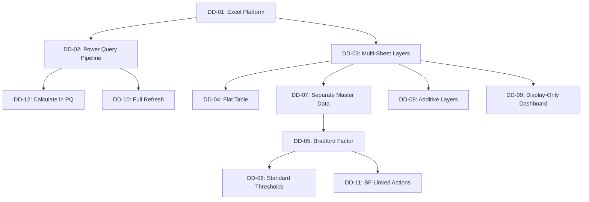

# 🧭 Design Decisions

## Overview

This document records the key design decisions made during the development of the Workforce Absenteeism Analytics Dashboard. Each decision is documented with the context, options considered, decision made, and rationale — following the Architecture Decision Record (ADR) format. These decisions shaped the dashboard into the solution it is today.

---

## 📋 Decision Index

| # | Decision | Phase | Impact |
|:--|:---------|:------|:-------|
| DD-01 | Platform: Excel over Power BI | Phase 1 | High |
| DD-02 | Data Pipeline: Power Query over VBA | Phase 1 | High |
| DD-03 | Architecture: Multi-Sheet Layered Design | Phase 1 | High |
| DD-04 | Data Format: Flat Table over Normalized | Phase 1 | Medium |
| DD-05 | Risk Scoring: Bradford Factor over Alternatives | Phase 2 | High |
| DD-06 | Risk Thresholds: Industry Standard Bands | Phase 2 | Medium |
| DD-07 | Master Data: Separate Sheets over Embedded | Phase 2 | Medium |
| DD-08 | Tenure Analysis: Additive Layer over Modification | Phase 3 | Medium |
| DD-09 | Dashboard: Display-Only Design | Phase 1 | High |
| DD-10 | Refresh Strategy: Full Refresh over Incremental | Phase 1 | Medium |
| DD-11 | Action Plan: BF-Linked Framework over Generic | Phase 1+ | High |
| DD-12 | Calculations: Power Query over Excel Formulas | Phase 1 | Medium |

---

## 📝 Decision Records

### DD-01: Platform — Excel over Power BI

| Attribute | Detail |
|:----------|:-------|
| **Phase** | Phase 1 |
| **Status** | Accepted |
| **Impact** | High |

**Context:** Needed a platform to build an interactive attendance analytics dashboard. Two primary options were available: Microsoft Excel (with Power Query and Pivot Tables) and Power BI.

**Options Considered:**

| Option | Pros | Cons |
|:-------|:-----|:-----|
| **Excel** | Already available (no license cost); team familiar with it; works offline; file-based sharing | Limited collaboration; no auto-refresh scheduling; scalability ceiling |
| **Power BI** | Web-based; auto-refresh; better collaboration; more visual options | Requires additional license/access; team not familiar; requires publishing infrastructure |

**Decision:** Excel

**Rationale:**
- Zero additional cost — no license request or IT approval needed
- Team was already using Excel daily — zero adoption barrier
- File-based sharing worked well for the team size and workflow
- Power Query + Pivot Tables provided sufficient analytical power for the use case
- Faster to build and iterate — no learning curve for a new platform

**Trade-off Accepted:** Limited collaboration and no auto-refresh scheduling. Mitigated by one-click manual refresh design.

---

### DD-02: Data Pipeline — Power Query over VBA

| Attribute | Detail |
|:----------|:-------|
| **Phase** | Phase 1 |
| **Status** | Accepted |
| **Impact** | High |

**Context:** Needed an automated way to ingest and transform raw attendance data monthly instead of manual copy-paste.

**Options Considered:**

| Option | Pros | Cons |
|:-------|:-----|:-----|
| **Power Query** | Visual interface; self-documenting steps; no programming required; built into Excel | Less flexible than code for complex logic |
| **VBA Macros** | Highly flexible; can do anything programmable | Requires coding skills; hard to maintain; macro security concerns; not self-documenting |
| **Manual Process** | No setup required | Time-consuming; error-prone; not scalable |

**Decision:** Power Query

**Rationale:**
- Visual, step-by-step interface makes transformations transparent and auditable
- No programming knowledge required — maintainable by anyone on the team
- Self-documenting — each transformation step is named and visible
- Built into modern Excel — no add-ins, no security concerns
- Sufficient for the data transformation complexity of this project

**Trade-off Accepted:** Less flexible than VBA for highly complex logic. Not needed for this use case.

---

### DD-03: Architecture — Multi-Sheet Layered Design

| Attribute | Detail |
|:----------|:-------|
| **Phase** | Phase 1 |
| **Status** | Accepted |
| **Impact** | High |

**Context:** Needed to decide how to organize the workbook — single sheet vs. multiple sheets.

**Options Considered:**

| Option | Pros | Cons |
|:-------|:-----|:-----|
| **Single sheet** | Everything in one place; simple navigation | Cluttered; hard to maintain; mixing data, calculations, and presentation |
| **Multi-sheet (unstructured)** | Some separation | No clear organization principle; can become messy |
| **Multi-sheet layered (chosen)** | Clear separation of concerns; each sheet has one job; extensible | More sheets to navigate; requires understanding of the architecture |

**Decision:** 4-layer, 9-sheet architecture (Input → Master → Analytics → Presentation)

**Rationale:**
- **Separation of concerns** ensures each sheet can be understood, debugged, and modified independently
- **Extensibility** was proven when Phases 2 and 3 added 4 new sheets without modifying any Phase 1 sheets
- **Maintainability** — any team member can follow the data flow through the layers
- **Clean presentation** — the Dashboard sheet only displays, never calculates

**Trade-off Accepted:** More sheets to navigate. Mitigated by clear naming and documented architecture.

---

### DD-04: Data Format — Flat Table over Normalized

| Attribute | Detail |
|:----------|:-------|
| **Phase** | Phase 1 |
| **Status** | Accepted |
| **Impact** | Medium |

**Context:** Needed to decide how to structure the core data in Attendance Files — normalized (separate tables for employees, months, etc.) or flat (all fields in one table).

**Decision:** Flat table with 13 columns

**Rationale:**
- Pivot tables work best with flat, denormalized data
- Eliminates the need for complex joins or relationships at the Excel level
- Simple and intuitive — anyone can read and understand the data
- Slight data redundancy (Team Leader repeated per row) is acceptable given the data volume

---

### DD-05: Risk Scoring — Bradford Factor over Alternatives

| Attribute | Detail |
|:----------|:-------|
| **Phase** | Phase 2 |
| **Status** | Accepted |
| **Impact** | High |

**Context:** Phase 1 used UPA% as the sole metric, which didn't capture absence patterns (frequency vs. duration). Needed a risk scoring methodology.

**Options Considered:**

| Option | How It Works | Limitation |
|:-------|:------------|:-----------|
| **Simple absence count** | Count total days | Treats all absence patterns the same |
| **Frequency rate** | Count absence instances | Ignores duration |
| **Lost time rate** | Hours lost ÷ scheduled hours | Doesn't capture disruption pattern |
| **Bradford Factor** | S² × D | Globally recognized; weights frequency appropriately |
| **Custom scoring** | Organization-defined | Subjective; not standardized |

**Decision:** Bradford Factor (S² × D)

**Rationale:**
- Industry-standard methodology recognized globally in HR analytics
- Mathematically weights frequent short absences more heavily — matching their real operational impact
- Simple to calculate and explain to non-technical stakeholders
- Well-documented with established threshold bands
- Provides objective, consistent scoring — eliminates subjective judgment

---

### DD-06: Risk Thresholds — Industry Standard Bands

| Attribute | Detail |
|:----------|:-------|
| **Phase** | Phase 2 |
| **Status** | Accepted |
| **Impact** | Medium |

**Context:** After implementing Bradford Factor, needed to decide what score ranges constitute Low, Medium, High risk.

**Decision:** Standard 4-tier bands (0–50, 51–100, 101–200, 201+)

**Rationale:**
- Most widely used Bradford Factor thresholds globally
- Progressive response escalation — support before discipline
- Balanced sensitivity — catches real patterns without over-flagging normal variation
- Can be recalibrated later based on organization-specific data

---

### DD-07: Master Data — Separate Sheets over Embedded

| Attribute | Detail |
|:----------|:-------|
| **Phase** | Phase 2 |
| **Status** | Accepted |
| **Impact** | Medium |

**Context:** Employee-to-Team Leader mapping was needed for BF Analysis. Options: embed in the Attendance Files or create a separate Employee Master sheet.

**Decision:** Separate Employee Master sheet

**Rationale:**
- Team structures change independently of attendance data
- Single source of truth — update team assignments in one place
- Lookup-based relationship (VLOOKUP) is simple and transparent
- Follows the separation of concerns principle established in DD-03

---

### DD-08: Tenure Analysis — Additive Layer over Modification

| Attribute | Detail |
|:----------|:-------|
| **Phase** | Phase 3 |
| **Status** | Accepted |
| **Impact** | Medium |

**Context:** New requirement to add tenure-based analysis. Options: modify the existing BF Analysis sheet to include tenure data, or create new sheets (DOJ Data + DOJ Enrichment).

**Decision:** Added new sheets without modifying existing ones

**Rationale:**
- **Preserved Phase 2 integrity** — BF Analysis continued working exactly as before
- **Additive architecture** — new capability layered on top, not injected into existing sheets
- **Independent maintenance** — DOJ data can be updated without touching BF Analysis
- **Validated the architecture** — proving that the multi-sheet design was truly extensible

---

### DD-09: Dashboard — Display-Only Design

| Attribute | Detail |
|:----------|:-------|
| **Phase** | Phase 1 |
| **Status** | Accepted |
| **Impact** | High |

**Context:** The Dashboard sheet could either contain its own calculations or purely display data calculated elsewhere.

**Decision:** Display-only — the Dashboard sheet contains zero calculations

**Rationale:**
- **Performance** — no formulas to recalculate on the presentation layer
- **Clarity** — stakeholders see only charts, KPIs, and slicers — no confusing raw data or formulas
- **Debugging** — if a chart shows wrong data, the issue is in the Pivot Backend, not the Dashboard
- **User experience** — non-technical users can interact confidently without risk of breaking formulas

---

### DD-10: Refresh Strategy — Full Refresh over Incremental

| Attribute | Detail |
|:----------|:-------|
| **Phase** | Phase 1 |
| **Status** | Accepted |
| **Impact** | Medium |

**Context:** When refreshing data, options were: full refresh (reload everything) or incremental (append only new data).

**Decision:** Full refresh

**Rationale:**
- **Simpler** — no logic needed to identify "new" vs. "existing" records
- **Safer** — ensures complete data consistency every refresh
- **Sufficient** — data volume is small enough that full refresh takes seconds
- **Corrective** — if source data is corrected retroactively, full refresh captures the corrections automatically

**Trade-off Accepted:** Slightly slower than incremental for very large datasets. Not a concern at current data volume.

---

### DD-11: Action Plan — BF-Linked Framework over Generic

| Attribute | Detail |
|:----------|:-------|
| **Phase** | Phase 1 (enhanced in Phase 2) |
| **Status** | Accepted |
| **Impact** | High |

**Context:** The dashboard needed an action component. Options: generic best-practice recommendations or a framework directly linked to the dashboard's risk scores.

**Decision:** 4-phase intervention framework linked to Bradford Factor risk tiers

**Rationale:**
- **Data-driven** — each phase corresponds to a specific BF score range
- **Actionable** — stakeholders know exactly what to do for each risk level
- **Progressive** — escalates from prevention to support to formal process
- **Measurable** — each strategy has a defined success metric
- **Universally applicable** — framework works for any organization, not just one specific company

---

### DD-12: Calculations — Power Query over Excel Formulas

| Attribute | Detail |
|:----------|:-------|
| **Phase** | Phase 1 |
| **Status** | Accepted |
| **Impact** | Medium |

**Context:** Key metrics (UPA%, Absence Days, BF Score) could be calculated in Power Query during data load or as Excel formulas on the Attendance Files sheet.

**Decision:** Calculate in Power Query where possible

**Rationale:**
- **Performance** — calculated once during load, not recalculated on every change
- **Consistency** — same logic applied to every row, guaranteed
- **No formula drift** — can't accidentally overwrite or fail to extend formula ranges
- **Cleaner sheets** — Attendance Files contains values, not complex formulas

---

## 📊 Decision Impact Summary

---

## 🔮 Decisions for Future Consideration

| Potential Decision | Context | When to Decide |
|:-------------------|:--------|:--------------|
| **Migrate to Power BI** | If collaboration needs grow or auto-refresh becomes critical | When user base expands beyond file-sharing |
| **Add predictive analytics** | Historical data could enable absence forecasting | When 12+ months of data is available |
| **Integrate with HRIS** | Direct data feed would eliminate even manual source file updates | When IT integration resources are available |
| **Recalibrate BF thresholds** | Organization-specific norms may differ from industry standard | After 6–12 months of data collection |
| **Add cost modeling** | Attach financial cost per absence day | When finance team provides cost data |

---

## 📚 Related Documents

- [Dashboard Architecture](dashboard-architecture.md) — The architecture these decisions shaped
- [Data Model](data-model.md) — The data model resulting from these decisions
- [Solution Design](../docs/solution-design.md) — Overall solution overview
- [Methodology](../docs/methodology.md) — Analytical approach guided by these decisions
- [Lessons Learned](../docs/lessons-learned.md) — Reflections that validate these decisions
