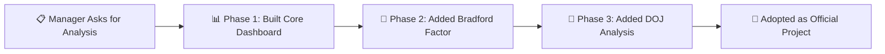

# 💼 Business Case

## Overview

This document outlines the business value, impact, and return on investment of the Workforce Absenteeism Analytics Dashboard. It translates the technical solution into business outcomes — demonstrating how a self-initiated analytics project evolved into an officially adopted workforce management tool.

---

## 🎯 Business Context

### The Starting Point

| Situation | Detail |
|:----------|:-------|
| **Initial request** | Manager provided raw attendance data and asked for analysis and findings |
| **Expected output** | A one-time report with observations |
| **Actual output** | A fully automated, interactive, reusable analytics platform |
| **Outcome** | Project was adopted as an official team initiative for ongoing use |

### The Business Problem

Workforce absenteeism impacts organizations across multiple dimensions:

| Impact Area | Consequence |
|:------------|:-----------|
| **Operational Continuity** | Unplanned absences create coverage gaps, affecting SLA delivery and service quality |
| **Workforce Planning** | Without visibility into patterns, staffing decisions are reactive rather than proactive |
| **Cost** | Overtime, temporary coverage, and lost productivity accumulate silently |
| **Team Morale** | Colleagues covering for frequently absent employees experience increased workload and frustration |
| **Management Time** | Managers spend time firefighting coverage issues instead of strategic work |
| **Employee Wellbeing** | Unaddressed absence patterns may signal underlying health, engagement, or workload issues |

---

## 📊 Value Delivered

### Quantifiable Impact

| Metric | Before Dashboard | After Dashboard | Improvement |
|:-------|:----------------|:---------------|:------------|
| **Time to produce monthly absence report** | 2–3 hours manual work | Seconds (one-click refresh) | ~99% time reduction |
| **Data accuracy** | Variable — human error in manual compilation | 100% consistent — automated pipeline | Eliminated manual errors |
| **Risk identification speed** | Weeks/months — patterns noticed only when obvious | Instant — Bradford Factor flags patterns automatically | From reactive to proactive |
| **Reporting coverage** | Ad-hoc, partial analysis | Complete workforce coverage every month | 100% visibility |
| **Decision-making speed** | Delayed — data had to be compiled first | Real-time — dashboard always ready | Immediate insight access |

### Strategic Value

| Value | How the Dashboard Delivers It |
|:------|:-----------------------------|
| **Proactive Management** | Bradford Factor identifies risk patterns before they become chronic — shifting from reactive firefighting to early intervention |
| **Data-Driven Decisions** | Every recommendation is backed by quantified scores and trends — no gut-feel decisions |
| **Fair & Consistent Treatment** | Same thresholds and criteria applied to everyone — eliminates subjective bias in attendance management |
| **Tenure-Informed Interventions** | DOJ cross-referencing ensures new joiners get onboarding support while tenured employees get re-engagement strategies |
| **Team-Level Accountability** | Team Leader performance view enables leadership to identify and support underperforming teams |
| **Continuous Improvement** | Monthly refresh cycle ensures the dashboard is a living tool, not a one-time report |

---

## 💰 Cost-Benefit Analysis

### Investment (Cost to Build)

| Resource | Investment |
|:---------|:----------|
| **Technology** | Zero — built with existing Microsoft Excel license (no additional software purchased) |
| **Development Time** | Self-initiated — built during regular working hours as part of analytical responsibilities |
| **Training** | Zero — dashboard is intuitive; slicers and charts require no training to use |
| **Maintenance** | Minimal — Power Query refresh is automated; only source file needs updating |

### Returns (Value Generated)

| Return Area | Estimated Impact |
|:------------|:----------------|
| **Time saved per month** | 2–3 hours of manual reporting eliminated per refresh cycle |
| **Faster risk identification** | Weeks of delayed detection reduced to instant flagging |
| **Reduced coverage firefighting** | Early intervention prevents last-minute scrambling for coverage |
| **Improved team planning** | Predictable absence patterns enable better shift/resource planning |
| **Employee retention** | Supportive early interventions address issues before employees disengage |
| **Management efficiency** | Managers spend less time compiling data, more time on strategic actions |

### ROI Summary

| Dimension | Assessment |
|:----------|:----------|
| **Financial Investment** | Virtually zero (no new tools or licenses) |
| **Time Investment** | Self-initiated development time |
| **Return** | Ongoing monthly time savings + proactive risk management + data-driven decisions |
| **ROI** | Extremely high — near-zero cost with recurring, compounding benefits |
| **Payback Period** | First monthly refresh — value delivered immediately |

---

## 📈 From One-Time Analysis to Official Project

### The Evolution

| Milestone | What Happened | Business Signal |
|:----------|:-------------|:---------------|
| **Initial Request** | Manager asked for data analysis | Standard task |
| **Phase 1 Delivery** | Delivered a full interactive dashboard instead of a static report | Exceeded expectations |
| **Phase 2 Enhancement** | Added Bradford Factor scoring when new requirements emerged | Demonstrated adaptability |
| **Phase 3 Enhancement** | Added tenure-based analysis for deeper workforce insights | Demonstrated continuous improvement |
| **Official Adoption** | Dashboard was adopted by the team for ongoing use | Validated business value |

### What Made It Successful

| Factor | Detail |
|:-------|:-------|
| **Over-delivered on expectations** | Manager expected a report; received a reusable platform |
| **Zero additional cost** | Built with existing tools — no budget request needed |
| **Self-initiated scope expansion** | Proactively added features as business needs evolved |
| **User-friendly design** | Slicers and visual charts made it accessible to non-technical stakeholders |
| **Actionable output** | Dashboard didn't just show data — it recommended actions |
| **Sustainable design** | One-click refresh meant it could be maintained by anyone |

---

## 🎯 Who Benefits

| Stakeholder | How They Benefit |
|:------------|:----------------|
| **Team Leaders** | See their team's attendance performance at a glance; get early warnings for at-risk employees |
| **Operations Managers** | Plan staffing and coverage proactively; compare team performance |
| **HR** | Data-backed attendance management; fair and consistent risk categorization |
| **Employees** | Supportive early interventions instead of surprise disciplinary actions |
| **Leadership** | Organization-wide visibility into workforce health; strategic decision support |
| **Analytics/MI Team** | Reusable framework that can be extended to other metrics |

---

## 🔮 Future Business Potential

If the dashboard were extended, additional business value could include:

| Enhancement | Business Value |
|:-----------|:-------------|
| **Migration to Power BI** | Web-based access, auto-scheduled refresh, mobile dashboards |
| **Predictive Analytics** | Machine learning models to forecast high-risk periods and employees |
| **Integration with HR Systems** | Direct data feed from HRIS eliminates even the source file step |
| **Multi-Department Rollout** | Same framework applied across the entire organization |
| **Cost Modeling** | Attach financial cost to each absence day for true cost visibility |
| **Wellbeing Correlation** | Link absence data with engagement surveys for holistic workforce insights |

---

## 📋 Key Takeaway

> **This project demonstrates that significant business value can be created with zero additional investment — by combining existing tools (Excel + Power Query) with analytical thinking, initiative, and a user-centered design approach. The result: a one-time data request transformed into an ongoing workforce intelligence platform.**

---

## 📚 Related Documents

- [Solution Design](solution-design.md) — Technical architecture
- [Methodology](methodology.md) — Analytical approach
- [Lessons Learned](lessons-learned.md) — Key reflections
- [Presentation Summary](../resources/presentation-summary.md) — One-page overview
- [FAQ](../resources/faq.md) — Common questions
