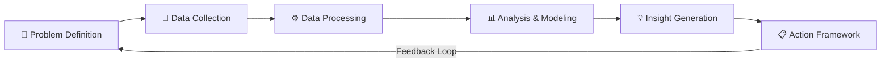

# 🔬 Methodology

## Overview

This document explains the analytical methodology used to design, build, and evolve the Workforce Absenteeism Analytics Dashboard. The approach follows a structured, data-driven framework that progressed through three iterative phases — each adding deeper analytical capability in response to evolving business requirements.

---

## 🎯 Methodological Approach

The project follows a **Problem → Data → Analysis → Insight → Action** methodology:



| Stage | What Happens | Tools Used |
|:------|:-------------|:-----------|
| **Problem Definition** | Understand what needs to be measured and why | Stakeholder discussions |
| **Data Collection** | Gather raw attendance records | Power Query (automated) |
| **Data Processing** | Clean, transform, and structure data | Power Query ETL pipeline |
| **Analysis & Modeling** | Calculate metrics, score risks, identify patterns | Pivot Tables, Bradford Factor, formulas |
| **Insight Generation** | Surface trends, comparisons, and risk profiles | Dashboard visualizations, KPI cards |
| **Action Framework** | Translate insights into strategic interventions | Data-driven intervention framework |

---

## 📐 Phase 1 Methodology: Core UPA Analysis

### Objective
Measure and visualize Unplanned Absence (UPA) across the workforce to identify patterns and outliers.

### Analytical Framework

**Step 1: Define the Core Metric**

UPA% (Unplanned Absence Percentage) was chosen as the primary metric because:
- It normalizes absence data across employees with different working day totals
- It enables fair comparison between months with different working days
- It's expressed as a percentage, making it intuitive for non-technical stakeholders

```
UPA% = UPA Days / Total Working Days
```

Where:
- UPA Days = Unplanned earned leave + (Half-day unplanned leave × 0.5)
- Total Working Days = Business days in the month minus public holidays

**Step 2: Automate Data Ingestion**

Power Query was selected over manual data entry because:

| Criteria | Manual Entry | Power Query |
|:---------|:------------|:------------|
| **Speed** | Hours per refresh | Seconds per refresh |
| **Accuracy** | Prone to human error | Consistent every time |
| **Scalability** | Breaks with more data | Handles growth seamlessly |
| **Auditability** | No trace of changes | Every step documented |
| **Repeatability** | Requires re-work each month | One-click refresh |

**Step 3: Multi-Dimensional Analysis**

Data was analyzed across three dimensions simultaneously:

| Dimension | What It Reveals | Visualization |
|:----------|:---------------|:-------------|
| **Time** | Monthly and yearly trends — is absenteeism increasing or decreasing? | Line Chart (UPA% Trend Over Time) |
| **Team** | Which teams have higher absenteeism — is it a leadership or team culture issue? | Bar Chart (Average UPA% by Team Leader) |
| **Individual** | Which specific employees are outliers? | Bar Charts (Top 5 and Top 20 by UPA%) |

**Step 4: KPI Benchmarking**

Three KPI summary cards provide instant context:

| KPI | Purpose |
|:----|:--------|
| **Average UPA%** | Organizational baseline — what's "normal" |
| **Highest UPA%** | Worst case — who needs immediate attention |
| **Lowest UPA%** | Best case — what's achievable as a benchmark |

---

## 🧮 Phase 2 Methodology: Bradford Factor Risk Scoring

### Objective
Move beyond simple UPA% tracking to identify **problematic absence patterns** — specifically, frequent short-term absences that are more operationally disruptive than occasional long absences.

### Why Bradford Factor?

UPA% alone has a critical blind spot:

| Scenario | UPA Days | UPA% | Operational Impact |
|:---------|:---------|:-----|:-------------------|
| **Employee A:** 1 absence of 10 days | 10 | High | Low — one disruption, team adjusts once |
| **Employee B:** 10 absences of 1 day each | 10 | Same High | **Very High** — 10 separate disruptions, unpredictable, team can't plan |

Both employees show the **same UPA%**, but Employee B is far more operationally damaging. The Bradford Factor solves this by squaring the number of spells:

```
BF = S² × D
```

| Employee | Spells (S) | Days (D) | BF Score |
|:---------|:-----------|:---------|:---------|
| Employee A | 1 | 10 | 1² × 10 = **10** |
| Employee B | 10 | 10 | 10² × 10 = **1,000** |

Employee B scores **100x higher** — correctly reflecting their greater operational disruption.

### Risk Categorization Methodology

The 4-tier risk system was designed using industry-standard Bradford Factor thresholds:

| BF Score | Risk Level | Rationale | Recommended Response |
|:---------|:-----------|:----------|:--------------------|
| **0–50** | 🟢 Low Risk | Normal attendance variability | No action — standard monitoring |
| **51–100** | 🟡 Monitor | Pattern may be developing | Watch for trends over next 1–2 months |
| **101–200** | 🟠 Potential Trend | Clear pattern of frequent absence | Supportive conversation, identify root causes |
| **201+** | 🔴 High Risk | Chronic problematic absence | Formal review with documented support plan |

**Why these thresholds?**
- They are the most commonly used Bradford Factor bands in HR analytics globally
- They balance sensitivity (catching real patterns) with specificity (not flagging normal variation)
- They align with progressive intervention — support before discipline

### Automation Design

The BF Analysis sheet uses nested IF formulas to automatically:
1. Calculate BF score for each employee
2. Categorize into the appropriate risk tier
3. Generate the recommended action text

This means **zero manual judgment** is needed — the dashboard tells stakeholders exactly what to do.

---

## 📅 Phase 3 Methodology: Tenure-Based Analysis

### Objective
Determine whether absenteeism patterns correlate with employee tenure — do new joiners behave differently from experienced staff?

### Why Tenure Matters

The same BF score can mean very different things depending on tenure:

| Scenario | BF Score | Tenure | Likely Root Cause | Appropriate Response |
|:---------|:---------|:-------|:------------------|:--------------------|
| **Employee X** | 150 | 3 months | Onboarding stress, role adjustment, commute issues | Onboarding support, buddy system, check-in |
| **Employee Y** | 150 | 5 years | Disengagement, burnout, personal issues | Re-engagement, wellness support, role refresh |

Same score, completely different interventions. Without tenure context, you might apply the wrong solution.

### Tenurity Classification

Employees are automatically classified into bands based on their Date of Joining:

| Band | Duration | Typical Characteristics |
|:-----|:---------|:-----------------------|
| **0–6 Months** | New joiner | Still adjusting — absences may reflect onboarding challenges |
| **6–12 Months** | Settling in | Should be stabilizing — persistent absences may signal poor fit |
| **1–2 Years** | Established | Patterns here reflect genuine attendance behavior |
| **2+ Years** | Tenured | Long-term patterns — may indicate burnout or disengagement if BF is high |

### Cross-Reference Analysis

The DOJ enrichment sheet creates a combined view:

```
[Employee Name] + [BF Score] + [Risk Level] + [DOJ] + [Tenurity Band] + [Team Leader]
```

This enables questions like:
- Are new joiners driving the absenteeism spike?
- Do tenured employees in certain teams show higher BF scores?
- Is there a "danger zone" tenure period where absences peak?

---

## 📊 Visualization Methodology

### Chart Selection Rationale

Each chart type was chosen deliberately:

| Chart | Type | Why This Type |
|:------|:-----|:-------------|
| **UPA% Trend** | Line Chart | Best for showing change over time — reveals seasonal patterns and trajectory |
| **TL Performance** | Bar Chart | Best for comparing categories — makes team-level differences immediately visible |
| **Top 5 UPA%** | Bar Chart | Focuses attention on the most critical outliers |
| **Top 20 Analysis** | Bar Chart | Broader view to catch patterns beyond the obvious top 5 |

### Slicer Design

Interactive slicers were added for three dimensions:

| Slicer | Why | Use Case |
|:-------|:----|:---------|
| **Year** | Enables year-over-year comparison | "Is 2026 worse than 2025?" |
| **Month** | Enables seasonal analysis | "Which months have the highest absenteeism?" |
| **Team Leader** | Enables team-level drill-down | "How does Team A compare to Team B?" |

---

## 🔄 Continuous Improvement Methodology

The dashboard is designed for **ongoing use**, not one-time analysis:

| Activity | Frequency | What Happens |
|:---------|:----------|:-------------|
| **Data Refresh** | Monthly | New attendance data loaded via Power Query; all calculations auto-update |
| **Trend Review** | Monthly | Compare current month to historical baseline |
| **Risk Assessment** | Monthly | Review BF scores for any employees crossing thresholds |
| **Quarterly Deep-Dive** | Quarterly | Analyze seasonal patterns, team-level shifts, tenure correlations |
| **Framework Review** | Quarterly | Assess if intervention strategies are working; adjust if needed |
| **Threshold Calibration** | Annual | Review if BF thresholds need adjustment based on organizational norms |

---

## 🎯 Methodology Outcomes

| Outcome | How It Was Achieved |
|:--------|:-------------------|
| **Automated monitoring** | Power Query + pivot tables refresh with one click |
| **Multi-dimensional visibility** | Time + Team + Individual analysis in one dashboard |
| **Risk quantification** | Bradford Factor converts subjective concern into objective scores |
| **Tenure-adjusted context** | DOJ cross-referencing prevents one-size-fits-all interventions |
| **Actionable output** | Every risk tier has a clear recommended response |
| **Scalable framework** | Methodology works for 10 employees or 10,000 |

---

## 📚 Related Documents

- [Solution Design](solution-design.md) — Complete architecture and design overview
- [Bradford Factor Explained](bradford-factor-explained.md) — Deep dive into the scoring system
- [Power Query Pipeline](power-query-pipeline.md) — Data ingestion and transformation details
- [Dashboard Architecture](../architecture/dashboard-architecture.md) — 9-sheet architecture details
- [Design Decisions](../architecture/design-decisions.md) — Key choices and trade-offs
