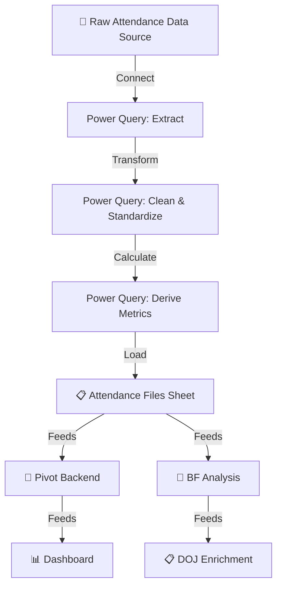

# ⚙️ Power Query Pipeline

## Overview

This document details the Power Query data pipeline that automates data ingestion, transformation, and loading for the Workforce Absenteeism Analytics Dashboard. Power Query serves as the **backbone of the entire solution** — it eliminates manual data handling and ensures consistent, repeatable data processing with a single click.

---

## 🎯 Why Power Query?

Before Power Query was implemented, attendance data was processed manually:

| Aspect | Before (Manual) | After (Power Query) |
|:-------|:----------------|:-------------------|
| **Monthly data loading** | 2–3 hours of copy-paste and formatting | Seconds — one-click refresh |
| **Error rate** | High — human errors in copying, formatting, formula ranges | Zero — same transformation applied every time |
| **Consistency** | Varied — different people processed data differently | 100% consistent — documented, repeatable steps |
| **Scalability** | Broke with more employees or months | Handles any volume without structural changes |
| **Audit trail** | None — changes were untraceable | Full — every step visible in Power Query Editor |
| **Skill dependency** | Required someone who knew the manual process | Anyone can refresh — the pipeline does the work |

---

## 🏗️ Pipeline Architecture

---

## 📋 Pipeline Stages

### Stage 1: Connect (Extract)

**What Happens:** Power Query establishes a connection to the raw attendance data source.

| Parameter | Detail |
|:----------|:-------|
| **Source Type** | Excel file / structured data source |
| **Connection** | Linked — not imported (data stays at source until refresh) |
| **Trigger** | Manual refresh (one-click) or can be scheduled |

**Why This Design:**
- Linked connection means the dashboard always reflects the latest data when refreshed
- No duplicate data storage — source remains the single source of truth
- Connection parameters are saved, so reconnection is automatic

---

### Stage 2: Clean & Standardize (Transform)

**What Happens:** Raw data is cleaned, formatted, and standardized for consistency.

**Transformation Steps:**

| Step | Transformation | Purpose |
|:-----|:--------------|:--------|
| 1 | **Promote Headers** | Ensure first row becomes column headers |
| 2 | **Set Data Types** | Assign correct types: text for names, numbers for days, percentages for UPA% |
| 3 | **Remove Blank Rows** | Eliminate empty rows that may exist in raw data |
| 4 | **Trim & Clean Text** | Remove leading/trailing spaces from names and text fields |
| 5 | **Standardize Names** | Ensure consistent formatting of employee and team leader names |
| 6 | **Validate Date Fields** | Ensure Month and Year columns are correctly formatted |
| 7 | **Handle Nulls** | Replace null/blank numeric fields with 0 where appropriate |
| 8 | **Filter Active Records** | Exclude terminated or inactive employees if flagged in source |

**Why This Design:**
- Raw data is rarely clean — these steps ensure the analytics engine receives consistent, reliable data
- Every transformation is documented and visible in the Power Query Editor
- If the source format changes, only the transformation steps need updating — not the entire dashboard

---

### Stage 3: Derive Metrics (Calculate)

**What Happens:** Key metrics are calculated within the Power Query pipeline before loading into Excel.

**Calculated Fields:**

| Field | Formula/Logic | Purpose |
|:------|:-------------|:--------|
| **UPA Days** | Earned Leave (unplanned) + Half EL × 0.5 | Core absence metric |
| **UPA%** | UPA Days ÷ Total Working Days | Normalized absence rate |
| **Actual Working Days** | Total Working Days - UPA Days | Days actually worked |
| **Absence Days (D)** | Total days absent across all spells | Bradford Factor input |
| **Absence Spells (S)** | Count of separate absence instances | Bradford Factor input |
| **Bradford Factor Score** | S² × D | Risk score |

**Why Calculate in Power Query vs. Excel Formulas:**

| Criteria | Power Query Calculation | Excel Formula |
|:---------|:-----------------------|:-------------|
| **Performance** | Calculated once during load — no recalculation overhead | Recalculates on every sheet change |
| **Consistency** | Same logic applied to every row guaranteed | Formula could be accidentally overwritten or not dragged down |
| **Scalability** | Handles thousands of rows with no slowdown | Large formula ranges can slow the workbook |
| **Maintainability** | Change the logic in one place — applies to all rows | Must update every cell if formula changes |

---

### Stage 4: Load

**What Happens:** Processed, clean, calculated data is loaded into the `Attendance Files` sheet.

| Parameter | Detail |
|:----------|:-------|
| **Destination** | Attendance Files sheet (Layer 1 of the dashboard architecture) |
| **Load Type** | Table format — enables pivot table connectivity |
| **Refresh Behavior** | Full refresh — replaces all data with latest processed version |
| **Row Count** | Dynamic — grows automatically as new months/employees are added |

**Output Schema (13 Fields):**

| # | Field | Type | Source |
|:--|:------|:-----|:-------|
| 1 | Name | Text | Raw data |
| 2 | Team Leader | Text | Raw data |
| 3 | Month | Text | Raw data |
| 4 | Year | Number | Raw data |
| 5 | EL (Earned Leave) | Number | Raw data |
| 6 | H EL (Half EL) | Number | Raw data |
| 7 | UPA Days | Number | Calculated |
| 8 | Total Working Days | Number | Raw data |
| 9 | UPA% | Percentage | Calculated |
| 10 | Actual Working Days | Number | Calculated |
| 11 | Absence Days (D) | Number | Calculated |
| 12 | Absence Spells (S) | Number | Calculated |
| 13 | Bradford Factor Score | Number | Calculated |

---

## 🔄 Refresh Process

### One-Click Refresh Flow

**What Refreshes Automatically:**

| Component | Auto-Refreshes? | Why |
|:----------|:----------------|:----|
| Attendance Files | ✅ Yes | Direct Power Query output |
| Pivot Backend | ✅ Yes | Pivots connected to the Attendance Files table |
| Dashboard Charts | ✅ Yes | Charts linked to pivot data |
| KPI Cards | ✅ Yes | Formulas reference the refreshed data |
| BF Analysis | ✅ Yes | Formulas reference the Attendance Files table |
| DOJ Enrichment | ✅ Yes | References BF Analysis (which auto-refreshes) |
| Analysis Sheet | ✅ Yes | Pivot connected to source data |
| Slicers | ✅ Yes | Connected to pivot tables |

**Result:** One click updates **everything** — from raw data to final dashboard.

---

## 🛡️ Error Handling

### Built-In Safeguards

| Scenario | How Power Query Handles It |
|:---------|:--------------------------|
| **Source file not found** | Displays connection error — dashboard retains last known data |
| **New columns in source** | Ignored unless explicitly added to the transformation steps |
| **Missing columns in source** | Error flagged at the specific step — easy to diagnose |
| **Blank/null values** | Handled in Stage 2 — nulls replaced with 0 or filtered out |
| **Data type mismatch** | Caught during Set Data Types step — flagged for correction |
| **Duplicate rows** | Can be removed in transformation if needed |

---

## 📊 Pipeline Performance

| Metric | Value |
|:-------|:------|
| **Refresh time** | Seconds (for typical monthly dataset) |
| **Manual effort per refresh** | Zero — one click |
| **Transformation steps** | ~8–10 documented steps |
| **Output fields** | 13 structured columns |
| **Scalability** | Handles growing datasets without modification |

---

## 🎯 Key Design Decisions

| Decision | Rationale |
|:---------|:----------|
| **Power Query over VBA macros** | Power Query is more maintainable, visual, and doesn't require programming knowledge |
| **Calculate in Power Query, not Excel** | Better performance, consistency, and scalability |
| **Full refresh over incremental** | Simpler to maintain, ensures complete data consistency |
| **Table format output** | Enables automatic pivot table expansion when new rows are added |
| **Single output sheet** | All downstream components read from one source — clean architecture |

---

## 💡 Lessons Learned from the Pipeline

| Lesson | Detail |
|:-------|:-------|
| **Automate early** | Building the pipeline first saved countless hours across all three phases of development |
| **Document transformations** | Power Query's visual step-by-step makes it self-documenting — a major advantage over VBA |
| **Design for growth** | Table format + dynamic ranges meant adding new months required zero structural changes |
| **Test with edge cases** | Null values and formatting inconsistencies in raw data were caught early by the pipeline |
| **One source of truth** | Having all downstream sheets read from one output eliminated data inconsistency issues |

---

## 📚 Related Documents

- [Solution Design](solution-design.md) — Where the pipeline fits in the overall architecture
- [Methodology](methodology.md) — How the pipeline supports the analytical approach
- [Dashboard Architecture](../architecture/dashboard-architecture.md) — How data flows from pipeline to dashboard
- [Data Model](../architecture/data-model.md) — Data relationships and field definitions
- [Design Decisions](../architecture/design-decisions.md) — Why Power Query was chosen
