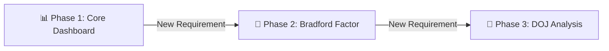
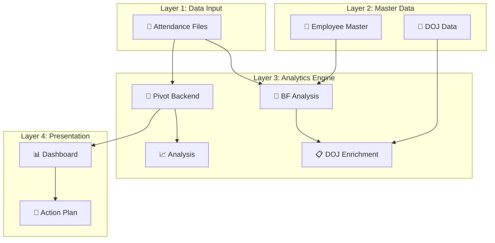
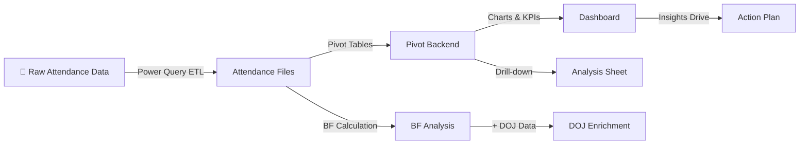

# 📐 Solution Design

## Overview

This document details the complete solution design of the Workforce Absenteeism Analytics Dashboard — from the initial request to the final multi-phase product. The dashboard was built iteratively across **three phases**, evolving from a basic UPA analysis tool into a comprehensive workforce intelligence platform.

---

## 🎯 Design Objective

**Original Ask:** Analyze raw attendance data and provide findings.

**What Was Delivered:** A fully automated, interactive, multi-layer Excel dashboard that ingests data via Power Query, calculates risk scores, visualizes trends, and provides actionable intervention strategies — evolving through three phases of requirements.

---

## 🔄 Iterative Evolution

The solution was not built all at once — it evolved as business needs grew:



| Phase | Trigger | What Was Added |
|:------|:--------|:---------------|
| **Phase 1** | Manager asked for attendance analysis | Core dashboard with Power Query pipeline, UPA% tracking, 4 charts, KPI cards, slicers |
| **Phase 2** | Need for risk scoring beyond basic UPA% | Bradford Factor engine (S² × D), 4-tier risk categorization, automated recommended actions, Employee Master |
| **Phase 3** | Need to understand tenure correlation | DOJ data integration, tenurity classification, tenure-adjusted risk assessment |

---

## 🏗️ Architecture Design

### Design Principles

| Principle | How It Was Applied |
|:----------|:-------------------|
| **Separation of Concerns** | Each sheet has a single, clear responsibility — no sheet does double duty |
| **Single Source of Truth** | Raw data enters through one point (Attendance Files); everything else derives from it |
| **Automation First** | Power Query handles all data ingestion — no manual copy-paste anywhere in the pipeline |
| **Scalability** | Adding new employees, months, or years requires zero structural changes |
| **Interactivity** | Slicers allow any user to explore data without modifying formulas or structure |
| **Actionability** | Data doesn't just sit in charts — it flows into risk scores, recommended actions, and intervention plans |

### 4-Layer Architecture



### Sheet-by-Sheet Design

#### Layer 1: Data Input

**Attendance Files**
- **Role:** Single entry point for all raw attendance data
- **Populated by:** Power Query (automated)
- **Fields:** Name, Team Leader, Month, Year, EL, Half EL, UPA Days, Total Working Days, UPA%, Actual Working Days, Absence Days (D), Absence Spells (S), Bradford Factor Score
- **Design Decision:** 13 fields provide comprehensive view while keeping the structure flat and pivot-friendly

#### Layer 2: Master Data

**Employee Master**
- **Role:** Maps every employee to their Team Leader
- **Added in:** Phase 2 (when Bradford Factor analysis needed team-level context)
- **Design Decision:** Kept as a separate sheet to enable easy updates when team structures change without affecting the data pipeline

**DOJ Data**
- **Role:** Stores Date of Joining and auto-calculates tenurity bands
- **Added in:** Phase 3
- **Tenurity Bands:** 0–6 months, 6–12 months, 1–2 years, 2+ tenured
- **Design Decision:** Tenurity is auto-calculated, not manually assigned — ensuring accuracy as time progresses

#### Layer 3: Analytics Engine

**Pivot Backend**
- **Role:** Core calculation engine powering the dashboard
- **Contains:** 4 separate pivot data areas:
  - Monthly UPA% Trend (by Year)
  - Selected Employee BF Scores
  - Team Leader Average UPA%
  - Top 20 Employee UPA%
- **Design Decision:** All pivots consolidated in one backend sheet to keep the dashboard sheet clean and focused on visualization

**BF Analysis**
- **Role:** Bradford Factor scoring and risk categorization
- **Added in:** Phase 2
- **Logic:** Calculates average BF score per employee → applies IF-based categorization → generates recommended action
- **Design Decision:** Risk thresholds (0–50, 51–100, 101–200, 201+) are industry-standard Bradford Factor bands

**DOJ (Enrichment)**
- **Role:** Combines BF scores with tenure data for deeper analysis
- **Added in:** Phase 3
- **Logic:** Cross-references BF Analysis with DOJ Data to show risk scores alongside tenure
- **Design Decision:** Enables tenure-adjusted interventions — a new joiner with high BF may need different support than a 5-year veteran

**Analysis**
- **Role:** UPA Days breakdown with interactive filtering
- **Contains:** Pivot table with Year/Month/Team Leader slicers
- **Design Decision:** Provides a drill-down view complementing the summary dashboard

#### Layer 4: Presentation & Action

**Dashboard**
- **Role:** Interactive visual interface for stakeholders
- **Contains:** 4 charts, 3 KPI cards, 3 slicers
- **Design Decision:** Dashboard only displays — it never calculates. All computation happens in Layer 3, keeping the dashboard fast and responsive

**Action Plan**
- **Role:** Translates data insights into strategic actions
- **Contains:** 4-phase intervention framework with success metrics
- **Design Decision:** Included directly in the workbook so the "what to do" lives alongside the "what the data shows"

---

## 📊 Data Flow Design



**Key Design Decisions in Data Flow:**

| Decision | Rationale |
|:---------|:----------|
| Power Query as entry point | Ensures data consistency, eliminates manual errors, enables one-click refresh |
| Pivots in a separate backend sheet | Keeps dashboard clean; pivots can be modified without affecting visuals |
| BF Analysis as standalone | Can be reviewed independently by HR without opening the full dashboard |
| DOJ as enrichment layer | Adds tenure context without modifying the core BF analysis |
| Action Plan in same workbook | Stakeholders see data and recommended actions in one place |

---

## 🧮 Key Formulas & Logic

### UPA% Calculation
```
UPA% = UPA Days / Total Working Days
```
Where UPA Days = EL (Earned Leave taken unplanned) + Half EL × 0.5

### Bradford Factor
```
BF = S² × D
```
Where S = Number of separate absence spells, D = Total absence days

### Risk Categorization (IF Logic)
```
IF BF > 200 → "High Risk — Formal Review"
IF BF > 100 → "Potential Trend — Informal Chat / Wellness Check"
IF BF > 50  → "Monitor Closely — Watch for Patterns"
ELSE        → "Low Risk — Standard Attendance"
```

### Tenurity Calculation
```
Tenurity Band = Based on (Current Date - Date of Joining)
  0–6 months    → "0 to 6 Months"
  6–12 months   → "6 to 12 Months"
  1–2 years     → "1 to 2 Years"
  2+ years      → "2+ Tenured"
```

---

## 🎯 Design Outcomes

| Outcome | Evidence |
|:--------|:---------|
| **Automation achieved** | Monthly data refresh takes seconds via Power Query, replacing hours of manual work |
| **Risk visibility created** | Bradford Factor identifies high-frequency absentees that UPA% alone would miss |
| **Team-level comparison enabled** | Team Leader performance view highlights which teams need intervention |
| **Tenure context added** | DOJ enrichment distinguishes new joiner struggles from tenured disengagement |
| **Actionable output delivered** | Every risk score comes with a recommended action — data leads to decisions |
| **Adopted as official project** | What started as a one-time analysis became the team's ongoing workforce analytics tool |

---

## 📚 Related Documents

- [Methodology](methodology.md) — Analytical approach and framework
- [Bradford Factor Explained](bradford-factor-explained.md) — Deep dive into the scoring system
- [Power Query Pipeline](power-query-pipeline.md) — Data ingestion details
- [Dashboard Architecture](../architecture/dashboard-architecture.md) — 9-sheet architecture details
- [Data Model](../architecture/data-model.md) — Data relationships and flow
- [Design Decisions](../architecture/design-decisions.md) — Key choices and trade-offs
