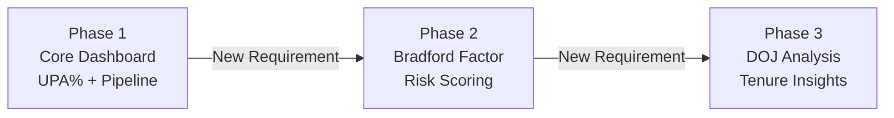

# 📌 Presentation Summary

## One-Page Project Overview

*Use this summary for interviews, presentations, or quick stakeholder briefings.*

---

## 🎯 The Elevator Pitch

> I was asked to analyze raw attendance data. Instead of a one-time report, I built a fully automated, interactive Excel dashboard that tracks unplanned absences, scores absenteeism risk using the Bradford Factor, and provides a strategic intervention framework — all with zero code. It evolved through three phases based on real business needs and was adopted as an official team project.

---

## 📊 Project at a Glance

| Attribute | Detail |
|:----------|:-------|
| **Project** | Workforce Absenteeism Analytics Dashboard |
| **Platform** | Advanced Excel + Power Query |
| **Code Required** | None — fully no-code solution |
| **Architecture** | 9 interconnected sheets across 4 functional layers |
| **Data Pipeline** | Power Query (automated ETL — one-click refresh) |
| **Analytics** | UPA% tracking + Bradford Factor risk scoring + tenure analysis |
| **Visualization** | Interactive dashboard with 4 charts, 3 KPI cards, 3 dynamic slicers |
| **Action Component** | 4-phase data-driven intervention framework with success metrics |
| **Evolution** | 3 iterative phases driven by real business requirements |
| **Outcome** | Adopted as an official team initiative for ongoing workforce analytics |

---

## 🔄 The Evolution Story

| Phase | Trigger | What Was Built | Value Added |
|:------|:--------|:---------------|:------------|
| **Phase 1** | Manager asked for attendance analysis | Automated dashboard with Power Query pipeline, UPA% tracking, 4 charts, KPIs, slicers | Replaced hours of manual work with one-click refresh |
| **Phase 2** | Need for pattern-based risk scoring | Bradford Factor engine (S² × D), 4-tier risk categorization, automated recommended actions | Identified high-frequency absentees that UPA% alone missed |
| **Phase 3** | Need to understand tenure correlation | DOJ data integration, tenurity bands, tenure-adjusted risk views | Enabled targeted interventions based on employee tenure |

---

## 🧠 Key Technical Highlights

### Power Query Pipeline
- Automated ETL: connects to raw data, transforms, calculates metrics, and loads — all in seconds
- Eliminated manual data processing entirely
- Self-documenting transformation steps

### Bradford Factor Implementation
- Industry-standard formula: **BF = S² × D**
- Penalizes frequent short absences (more operationally disruptive) over infrequent long absences
- Automated 4-tier risk categorization with recommended actions per tier

### 4-Layer Architecture
- **Layer 1 — Input:** Power Query loads data into Attendance Files
- **Layer 2 — Master:** Employee Master + DOJ Data provide context
- **Layer 3 — Analytics:** Pivot Backend + BF Analysis + DOJ Enrichment + Analysis crunch the numbers
- **Layer 4 — Presentation:** Dashboard displays; Action Plan recommends

### Data-Driven Intervention Framework
- 4 phases linked to Bradford Factor risk tiers (Preventive → Early → Targeted → Recovery)
- Each strategy includes approach, expected outcome, and success metric
- Continuous improvement loop with monthly/quarterly/annual review cadence

---

## 🛠️ Skills Demonstrated

| Category | Specific Skills |
|:---------|:---------------|
| **Data Engineering** | Power Query ETL, automated data pipeline, data transformation |
| **Data Modeling** | Multi-sheet relational architecture, master data management |
| **Analytics** | Bradford Factor, trend analysis, risk scoring, comparative analysis |
| **Visualization** | Interactive dashboards, charts, KPI cards, slicers, conditional formatting |
| **Business Intelligence** | Translating raw data into actionable workforce insights |
| **Strategic Thinking** | Multi-phase intervention framework with measurable outcomes |
| **Automation** | One-click refresh, auto-calculated scores, automated risk categorization |
| **Problem Solving** | Transformed a data request into a comprehensive analytics platform |

---

## 💡 What Makes This Stand Out

| Differentiator | Why It Matters |
|:--------------|:---------------|
| **Real business origin** | Not a tutorial or course project — born from an actual workplace need |
| **Iterative evolution** | Three phases driven by real requirements — shows adaptability |
| **Officially adopted** | The team took it over for ongoing use — validates real business value |
| **Zero cost** | Built with existing tools — no additional licenses or infrastructure |
| **Self-initiated expansion** | Manager asked for analysis; I delivered a platform |
| **Complete solution** | Data pipeline + analytics + visualization + action plan — end-to-end |

---

## ❓ Key Interview Questions & Answers

**Q: What was the biggest challenge?**
> Designing an architecture that could evolve without breaking. Phase 1 sheets were never modified when Phases 2 and 3 were added — proving the separation of concerns design worked.

**Q: Why Excel instead of Power BI?**
> Zero additional cost, zero adoption barrier (team already used Excel daily), and sufficient analytical power for the use case. It was the pragmatic choice that maximized speed-to-value.

**Q: What would you do differently?**
> I'd document design decisions during the build process (not after), involve end users earlier, and evaluate Power BI migration sooner for web-based access and auto-scheduled refresh.

**Q: How does the Bradford Factor work?**
> BF = S² × D, where S is the number of separate absence spells and D is total absence days. By squaring the spells, it penalizes frequent short absences more heavily — because 10 separate 1-day absences are far more operationally disruptive than one 10-day absence.

**Q: What was the business impact?**
> Monthly reporting went from 2–3 hours to seconds. Risk identification shifted from reactive (weeks/months) to proactive (instant). The dashboard was adopted as an official project — it's still in use.

---

## 📂 Full Documentation

| Document | Link |
|:---------|:-----|
| Solution Design | [docs/solution-design.md](../docs/solution-design.md) |
| Methodology | [docs/methodology.md](../docs/methodology.md) |
| Bradford Factor Explained | [docs/bradford-factor-explained.md](../docs/bradford-factor-explained.md) |
| Power Query Pipeline | [docs/power-query-pipeline.md](../docs/power-query-pipeline.md) |
| Business Case | [docs/business-case.md](../docs/business-case.md) |
| Lessons Learned | [docs/lessons-learned.md](../docs/lessons-learned.md) |
| Dashboard Architecture | [architecture/dashboard-architecture.md](../architecture/dashboard-architecture.md) |
| Data Model | [architecture/data-model.md](../architecture/data-model.md) |
| Design Decisions | [architecture/design-decisions.md](../architecture/design-decisions.md) |
| FAQ | [faq.md](faq.md) |

---

## 📚 Related Documents

- [FAQ](faq.md) — Detailed answers to common questions
- [README](../README.md) — Full project overview
